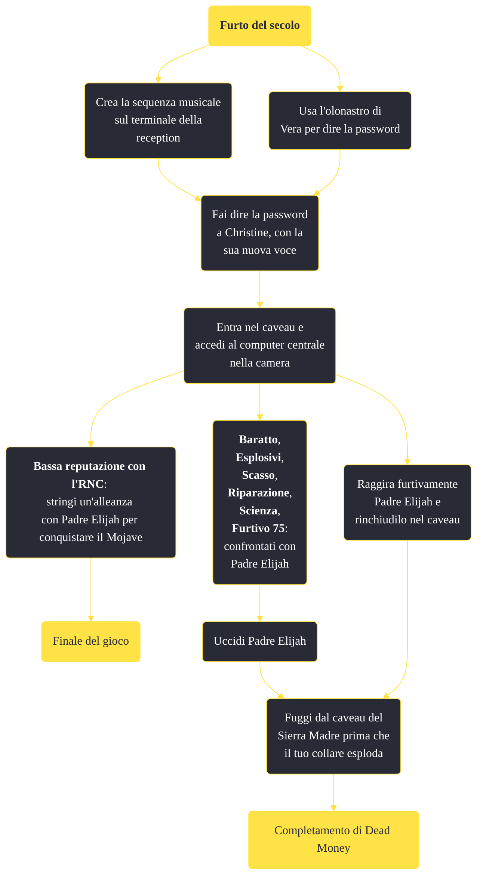

---
# Title, summary, and page position.
linktitle: "Furto del secolo"
summary: ""
weight: 10
icon: message-question
icon_pack: fas

# Page metadata.
title: "Furto del secolo"
date: 2022-11-15
type: book # Do not modify.
commentable: true
tags: "Missioni di Dead Money"
hidden: true # Visibile nella sidebar
private: false # Nascosto dalle ricerche
---

*Furto del secolo* è una missione del DLC *Dead Money* di Fallout:New Vegas. È data da Padre Elijah al caveau del Casinò Sierra Madre.

<section class="chart-collapse">
<input type="checkbox" name="collapse2" id="handle2">
<h3 class="handle">
<label for="handle2">Clicca per mostrare il diagramma</label>
</h3>

</section>

| Tappe |       Stato        | Descrizione |
|:-----:|:------------------:| ----------- |
|                           10                          |            | Componi la sequenza musicale di Vera al terminale della reception all'ingresso.                                                                                             |
|                           20                          |            | Accedi al caveau del Sierra Madre.                                                                                                                                          |
|                           30                          |            | Scopri i segreti del Sierra Madre nella stanza centrale del caveau.                                                                                                         |
|                           40                          |            | Sconfiggi Elijah.                                                                                                                                                           |
|                           45                          |            | (Opzionale) Esci dal caveau senza essere individuato e intrappola Elijah quando apre il caveau.                                                                             |
|                           50                          | :white_check_mark: | Fuggi dal caveau del Sierra Madre prima che il tuo collare esploda.                                                                                                         |

**Sfide abilità**:
- **Baratto 75**/**Esplosivi 75**/**Scasso 75**/**Riparazione 75**/**Scienza 75**/**Furtivo 75**: per affrontare Padre Elijah 

**Note**:
- È possibile, con un po' di abilità, prendere tutti i lingotti d'oro e intrappolare Elijah nel caveau:
  - Entrati nel caveau, sarà necessario interagire con il terminale di sicurezza e disattivare i protocolli di sicurezza
  - Prendere tutte le barre d'oro
  - Interagire con il terminale di controllo al centro
  - Bisognerà selezionare tutte le opzioni che riguardano Vera, in questo ordine: *Vera Keyes*, *Vera*, *A Vera* e, arrivati alla schermata in cui è possibile sezionare Vera Keyes e il Profilo personale di Sinclair, spegnere il terminale senza selezionare nulla
  - Elijah apparirà sullo schermo dietro al terminale
  -  Selezionare il dialogo "Sono stanco di parlare ad un'immagine sullo schermo. Se hai intenzione di scendere, fallo" e "Non sono interessato al vault, voglio solo andarmene"
  - Passare due sfide **Eloquenza** o **Baratto 75** e selezionare "Hai ragione, sarà diverso, deve essere diverso"
  - Passare un'altra sfida **Eloquenza 75**
  - Una volta fatto ciò, affrettarsi ad uscire dal caveau e nascondersi dietro gli alternatori subito a destra dell'entrata (meglio sarebbe utilizzare uno Stealth Boy) e non farsi notare da Elijah
  - Non appena Elijah sarà vicino al terminale d'entrata del caveau, dirigersi verso l'uscita lì vicino, cercando di raggiungerla prima che si attivi il campo di forza
  - Uscire dalla struttura

