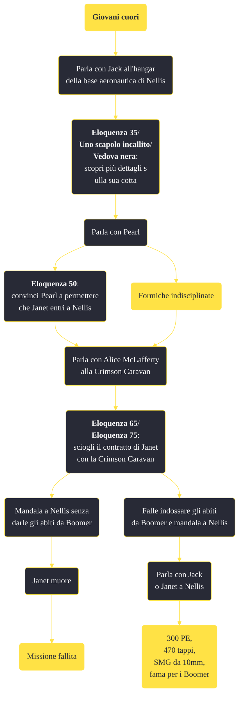

---
# Title, summary, and page position.
linktitle: "Giovani cuori"
summary: ""
weight: 10
icon: message-question
icon_pack: fas

# Page metadata.
title: "Giovani cuori"
date: 2022-11-15
type: book # Do not modify.
commentable: true
tags: "Missioni secondarie di Fallout: New Vegas"
hidden: true # Visibile nella sidebar
private: false # Nascosto dalle ricerche
---

*Giovani cuori* è una missione secondaria di Fallout: New Vegas. È data da Jack alla base aeronautica di Nellis.

<section class="chart-collapse">
<input type="checkbox" name="collapse2" id="handle2">
<h3 class="handle">
<label for="handle2">Clicca per mostrare il diagramma</label>
</h3>

</section>

| Tappe |       Stato        | Descrizione |
|:-----:|:------------------:| ----------- |
|                           5                           |            | Trova la destinataria dell'amore di Jack.                                                                                                                                   |
|                           10                          |            | Chiedi a Pearl di autorizzare Janet ad entrare a Nellis.                                                                                                                    |
|                           20                          |            | Di' a Jack che Janet è interessata a lui.                                                                                                                                   |
|                           30                          |            | Porta i vestiti da Boomer a Janet.                                                                                                                                          |
|                           40                          |            | Parla con Alice McLafferty per conto di Janet.                                                                                                                              |
|                           50                          |            | Comunica a Janet che McLafferty ha accettato di pagarla.                                                                                                                    |
|                           55                          |            | Comunica a Janet che McLafferty non la pagherà.                                                                                                                             |
|                           70                          |            | Incontra Janet a Nellis.                                                                                                                                                    |
|                           80                          | :white_check_mark: | Torna da Jack.                                                                                                                                                              |

**Sfide abilità**:
- **Eloquenza 35**/**Uno scapolo incallito**/**Vedova nera**: per scoprire da Jack più dettagli sulla sua relazione
- **Eloquenza 50**: per convincere Pearl 
- **Eloquenza 75**/**Baratto 65**: per convincere Alice McLafferty

**Note**:
- Se si finisce *Volare!* prima di completare *Giovani Cuori*, Jack sparirà dalla mappa e non sarà più possibile completare la missione 

