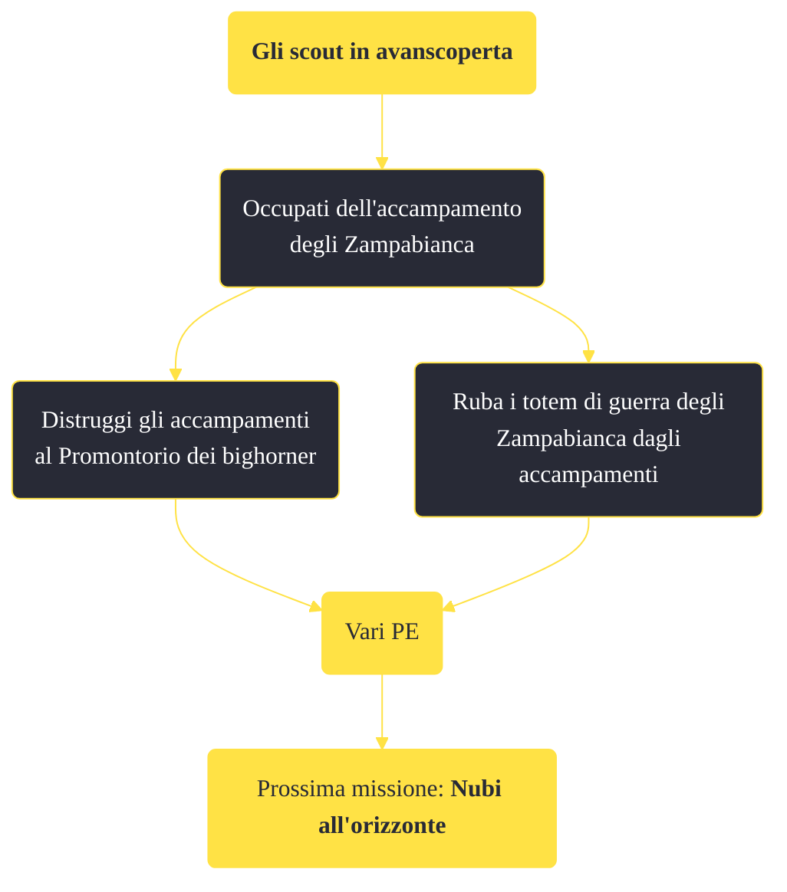

---
# Title, summary, and page position.
linktitle: "Gli scout in avanscoperta"
summary: ""
weight: 10
icon: message-question
icon_pack: fas

# Page metadata.
title: "Gli scout in avanscoperta"
date: 2022-11-15
type: book # Do not modify.
commentable: true
tags: "Missioni di Honest Hearts"
hidden: true # Visibile nella sidebar
private: false # Nascosto dalle ricerche
---

*Gli scout in avanscoperta* è una missione del DLC *Honest Hearts* di Fallout: New Vegas. È data da Joshua Graham.

**Riassunto**:
1. Occupati dell'accampamento degli Zampabianca
   - Distruggi gli accampamenti al Promontorio dei bighorner
   - Ruba i totem di guerra degli Zampabianca dagli accampamenti
2. Ricompensa: **vari PE**
3. Prossima missione: *Nubi all'orizzonte*

<section class="chart-collapse">
<input type="checkbox" name="collapse2" id="handle2">
<h3 class="handle">
<label for="handle2">Clicca per mostrare il diagramma</label>
</h3>

</section>

| Tappe |       Stato        | Descrizione |
|:-----:|:------------------:| ----------- |
|                           5                           | :white_check_mark: | Attacca l'accampamento degli Zampabianca.                                                                                                                                   |
|                           15                          | :white_check_mark: | Opzionale: Ruba i totem di guerra degli Zampabianca dagli accampamenti.                                                                                                     |
|                           18                          | :white_check_mark: | Opzionale: Annienta gli accampamenti degli Zampabianca al Promontorio dei bighorner.                                                                                        |

**Note**:
- Talvolta alcuni Yao Guai compariranno nei pressi dell'accampamento, rendendo molto più facile completare la missione

