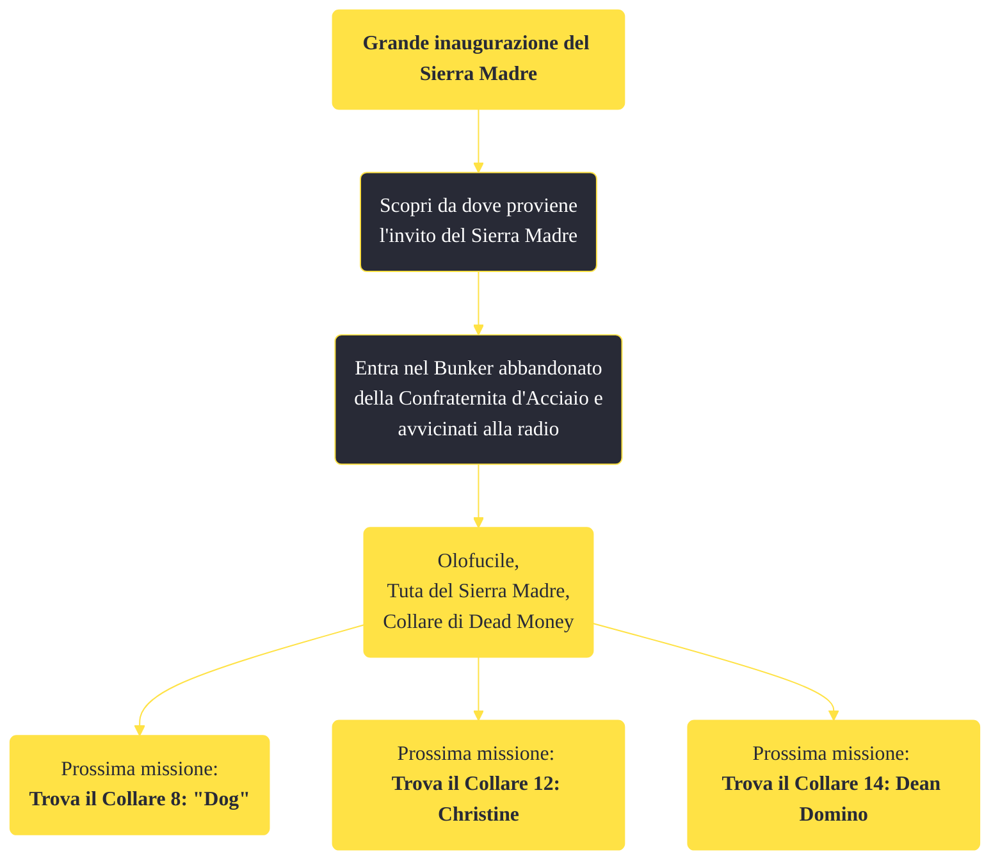

---
# Title, summary, and page position.
linktitle: "Grande inaugurazione del Sierra Madre"
summary: ""
weight: 10
icon: message-question
icon_pack: fas

# Page metadata.
title: "Grande inaugurazione del Sierra Madre"
date: 2022-11-15
type: book # Do not modify.
commentable: true
tags: "Missioni di Dead Money"
hidden: true # Visibile nella sidebar
private: false # Nascosto dalle ricerche
---

*Grande inaugurazione del Sierra Madre* è una missione del DLC *Dead Money* di Fallout:New Vegas. È data da Padre Elijah nel bunker abbandonato della Confraternita d'Acciaio.

<section class="chart-collapse">
<input type="checkbox" name="collapse2" id="handle2">
<h3 class="handle">
<label for="handle2">Clicca per mostrare il diagramma</label>
</h3>

</section>

| Tappe |       Stato        | Descrizione |
|:-----:|:------------------:| ----------- |
|                           10                          | :white_check_mark: | Scopri da dove proviene l'invito del Sierra Madre.                                                                                                                          |

**Sfide abilità**:
- 

**Note**:
- Prima di iniziare questa missione, è consigliabile alleggerirsi il più possibile, conservandosi però una notevole quantità di droghe, vista la penuria di queste in tutto il DLC 

