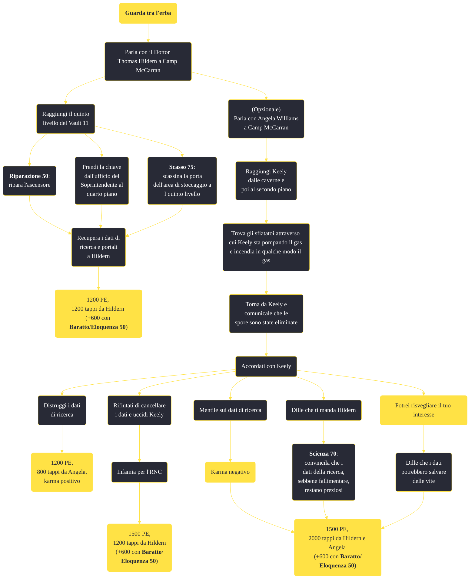

---
# Title, summary, and page position.
linktitle: "Guarda tra l'erba"
summary: ""
weight: 10
icon: message-question
icon_pack: fas

# Page metadata.
title: "Guarda tra l'erba"
date: 2022-11-15
type: book # Do not modify.
commentable: true
tags: "Missioni secondarie di Fallout: New Vegas"
hidden: true # Visibile nella sidebar
private: false # Nascosto dalle ricerche
---

*Guarda tra l'erba* è una missione secondaria di Fallout: New Vegas. È data da Thomas Hildern a Camp McCarran.

**Riassunto**:
La missione si può svolgere in due modi diversi: seguendo le istruzioni del Dottor Thomas  Hildern o quelle di Angela Williams e della dottoressa Keely

Se segui le istruzioni di Hildern...
1. Parla con il Dottor Thomas Hildern a Camp McCarran
2. Raggiungi il quinto livello del Vault 11
   - **Riparazione 50**: ripara l'ascensore
   - Prendi la chiave dall'ufficio del Soprintendente al quarto piano
   - **Scasso 75**: scassina la porta dell'area di stoccaggio al quinto livello
3. Recupera i dati di ricerca e portali a Hildern
4. Ricompensa: **1200 PE**, **1200 tappi** da Hildern (+600 con **Baratto**/**Eloquenza 50**

Se segui le istruzioni di Angela Williams...
1. Parla con il Dottor Thomas Hildern e poi con Angela Williams a Camp McCarran
2. Raggiungi Keely dalle caverne e poi al secondo piano
3. Trova gli sfiatatoi attraverso cui Keely sta pompando il gas
4. Incendia in qualche modo il gas
5.  Torna da Keely e comunicale che le spore sono state eliminate
6.  Accordati con Keely
   -  Distruggi i dati di ricerca: **1200 PE**, **800 tappi** da Angela, **karma positivo**
   -  Rifiutati di cancellare i dati e uccidi Keely: **infamia per l'RNC**, **1500 PE**, **1200 tappi** da Hildern (+600 con **Baratto**/**Eloquenza 50**)
   -  Mentile sui dati di ricerca: **karma negativo**, **1500 PE**, **2000 tappi** da Hildern e Angela (+600 con **Baratto**/**Eloquenza 50**)
   -  **Scienza 70**: convincila che i dati della ricerca, sebbene fallimentare, restano preziosi* **1500 PE**, **2000 tappi** da Hildern e Angela (+600 con **Baratto**/**Eloquenza 50**)
   -  Se hai già iniziato *Potrei risvegliare il tuo interesse*, dille che i dati potrebbero salvare delle vite: **1500 PE**, **2000 tappi** da Hildern e Angela (+600 con **Baratto**/**Eloquenza 50**)

<section class="chart-collapse">
<input type="checkbox" name="collapse2" id="handle2">
<h3 class="handle">
<label for="handle2">Clicca per mostrare il diagramma</label>
</h3>

</section>

| Tappe |       Stato        | Descrizione |
|:-----:|:------------------:| ----------- |
|                           10                          |            | Entra nel Vault 22 e scarica i dati di ricerca che vi troverai.                                                                                                             |
|                           20                          |            | Torna dal Dott. Hildern a Camp McCarran con i dati di ricerca.                                                                                                              |
|                           30                          |            | (Opzionale) Trova Keely, una ricercatrice scomparsa al Vault 22.                                                                                                            |
|                           40                          |            | Incontra Keely nella sua base operativa al secondo livello.                                                                                                                 |
|                           50                          |            | Trova gli sfiatatoi attraverso cui Keely sta pompando il gas e incendia in qualche modo il gas.                                                                             |
|                           60                          |            | Torna da Keely e comunicale che le spore sono state eliminate.                                                                                                              |
|                           70                          | :white_check_mark: | Torna a Camp McCarran e riferisci al Dott. Williams che Keely è sana e salva.                                                                                               |

**Sfide abilità**:
- **Riparazione 50**: per riparare l'ascensore nel Vault 22
- **Scasso 75**: per scassinare la porta dell'area di stoccaggio al quinto livello
- **Scienza 70**: per convincere Keely a non eliminare i dati di ricerca (questa opzione è disponibile solo dopo averle detto che è stato Hildern a mandare il Corriere a cercarla)
- **Eloquenza**/**Baratto 50**: per ottenere fino a 1800 tappi di ricompensa, a fine missione

**Note**:
- Se *Potrei risvegliare il tuo interesse* è già stata completata, l'opzione di dialogo per recuperare i dati dal Vault 22 senza conseguenze verrà persa
- Se i dati sono già stati scaricati prima di iniziare la missione, il Corriere potrà dare i dati immediatamente a Hildern
- Uccidere Keely non fa guadagnare karma negativo, ma mentire a Williams sulla sua morte invece sì
- Se i dati vengono cancellati, non ci sarà nessuna ricompensa e i PE guadagnati saranno solo di 1200 (invece di 1500)
- Dicendo alla Dott.ssa Williams che Keely è ancora viva farà guadagnare al Corriere altri 800 tappi
- Se si finisce questa missione prima di aver completato *Puoi dipendere da me*, sarà impossibile consegnare la fattura a Hildern, a causa di un bug; è dunque consigliabile avanzare prima in *Puoi dipendere da me* e poi concludere *Guarda tra l'erba*
- Il gioco potrebbe crashare spesso, raggiunto il quinto livello; un rimedio temporaneo è quello di lasciare i seguaci al secondo livello 

