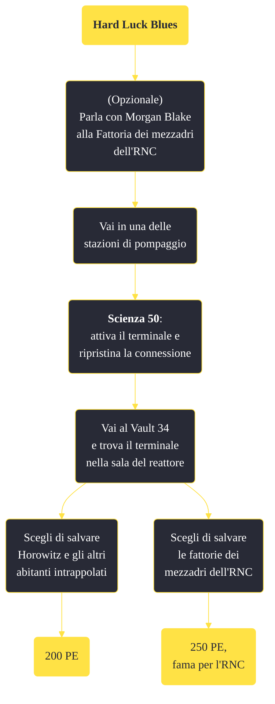

---
# Title, summary, and page position.
linktitle: "Hard Luck Blues"
summary: ""
weight: 10
icon: message-question
icon_pack: fas

# Page metadata.
title: "Hard Luck Blues"
date: 2022-11-15
type: book # Do not modify.
commentable: true
tags: "Missioni secondarie di Fallout: New Vegas"
hidden: true # Visibile nella sidebar
private: false # Nascosto dalle ricerche
---

*Hard Luck Blues* è una missione secondaria di Fallout: New Vegas. È data da Morgan Blake alla stazione di pompaggio est.

<section class="chart-collapse">
<input type="checkbox" name="collapse2" id="handle2">
<h3 class="handle">
<label for="handle2">Clicca per mostrare il diagramma</label>
</h3>

</section>

| Tappe |       Stato        | Descrizione |
|:-----:|:------------------:| ----------- |
|                           10                          |            | Indaga sulla Stazione di pompaggio est.                                                                                                                                     |
|                           20                          |            | Trova l'origine della radiazione.                                                                                                                                           |
|                           30                          |            | Disattiva il reattore del Vault 34 per aiutare le fattorie dei mezzadri.                                                                                                    |
|                           40                          | :white_check_mark: | (Opzionale) Salva gli abitanti intrappolati del Vault 34 senza danneggiare il reattore, condannando a una fine sicura le fattorie dei mezzadri.                             |

**Sfide abilità**:
- **Scasso 100**: per aprire l'armeria senza la chiave (situata nella baracca di Pearl a Nellis)
- **Scienza 50**: per attivare il terminale e ripristinare la connessione"

**Note**:
- Nell'esplorazione del Vault 34 è molto utile munirsi di rebreather, poiché molte aree sono allagate e sommerse 

