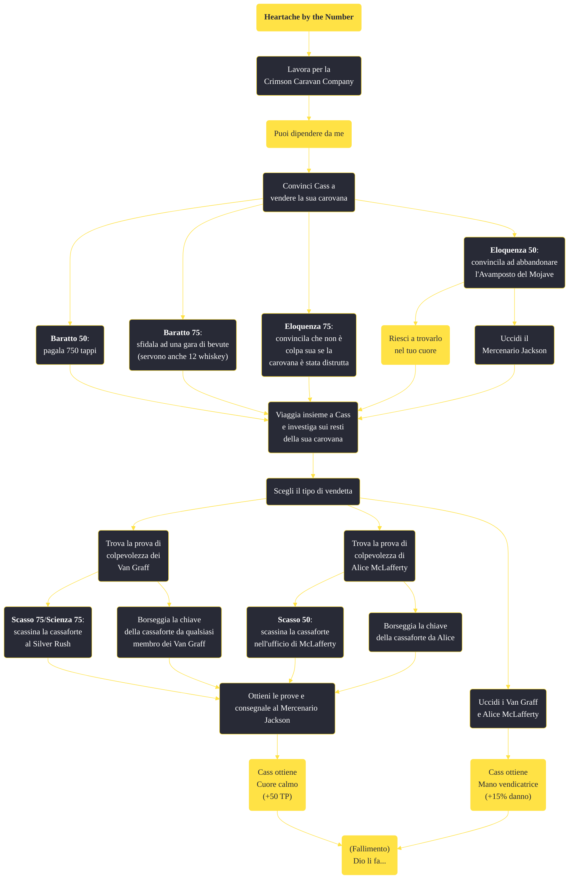

---
# Title, summary, and page position.
linktitle: "Heartache by the Number"
summary: ""
weight: 10
icon: message-question
icon_pack: fas

# Page metadata.
title: "Heartache by the Number"
date: 2022-11-15
type: book # Do not modify.
commentable: true
tags: "Missioni secondarie di Fallout: New Vegas"
hidden: true # Visibile nella sidebar
private: false # Nascosto dalle ricerche
---

*Heartache by the Number* è una missione secondaria di Fallout: New Vegas. È data da Cass all'Avamposto del Mojave.

**Riassunto**:
1. Lavora per la Crimson Caravan Company
2. Continua la missione *Puoi dipendere da me*
3. Convinci Cass a vendere la sua carovana
   - **Baratto 50**: pagala 750 tappi
   - **Baratto 75**: sfidala ad una gara di bevute (servono anche 12 whiskey)
   - **Eloquenza 75**: convincila che non è colpa sua se la carovana è stata distrutta
   - **Eloquenza 50**: convincila ad abbandonare l'Avamposto del Mojave
      - Completa *Riesci a trovarlo nel tuo cuore*
      - Uccidi il Mercenario Jackson
4.  Viaggia insieme a Cass e investiga sui resti della sua carovana
5.  Scegli il tipo di vendetta
   -  Se scegli di risolsere la questione pacificamente 
        -  Trova la prova di colpevolezza dei Van Graff
            -  **Scasso 75**/**Scienza 75**: scassina la cassaforte al Silver Rush
            -  Borseggia la chiave della cassaforte da qualsiasi membro dei Van Graff
        -  Trova la prova di colpevolezza di Alice McLafferty
            -  **Scasso 50**: scassina la cassaforte nell'ufficio di McLafferty
            -  Borseggia la chiave della cassaforte da Alice
        -  Ottieni le prove e consegnale al Mercenario Jackson: Cass ottiene **Cuore calmo** (+50 TP)
   - Se scegli di vendicarti, uccidendo i Van Graff e Alice McLafferty: Cass ottiene **Mano vendicatrice** (+15% danno)
 6.  (Fallimento) *Dio li fa...*

<section class="chart-collapse">
<input type="checkbox" name="collapse2" id="handle2">
<h3 class="handle">
<label for="handle2">Clicca per mostrare il diagramma</label>
</h3>

</section>

| Tappe |       Stato        | Descrizione |
|:-----:|:------------------:| ----------- |
|                           5                           |            | Cass sta annegando il suo rimpianto all'Avamposto del Mojave. Il suo consiglio? Va a lavorare per la Crimson Caravan.                                                       |
|                           6                           |            | Aiuta la compagnia Crimson Caravan se sei in cerca di un lavoro da loro.                                                                                                    |
|                           7                           |            | Ritorna da Cass a vedi se puoi prendere la sua parte di azioni della Cassidy Caravans.                                                                                      |
|                           8                           |            | Ripulisci la strada per Jackson al quartier generale dell'avamposto del Mojave per permettere a Cass di partire.                                                            |
|                           9                           |            | (Optional) "Rimuovi" Jackson come se fosse un ostacolo senza che Cass o altri lo sappiano.                                                                                  |
|                           10                          |            | Rendi omaggio a Cass alla tomba della sua carovana.                                                                                                                         |
|                           20                          |            | Indaga ad Asphalt 17 con Cass alla ricerca di indizi sugli assalitori.                                                                                                      |
|                           30                          |            | Rintraccia l'ultima carovana mancante a Dry Gulch.                                                                                                                          |
|                           40                          |            | Indaga alla Crimson Caravan sui motivi alla base dell'attacco.                                                                                                              |
|                           50                          |            | Cerca al Silver Rush di Freeside indizi sulla colpevolezza dei Van Graff.                                                                                                   |
|                           60                          |            | Porta le prove degli attacchi alla carovana a Jackson all'avamposto del Mojave.                                                                                             |
|                           70                          | :white_check_mark: | Prove passate all'RNC.                                                                                                                                                      |
|                           80                          |            | Trova quella stronza di Alice McLafferty al campo della Crimson Caravan e "regola i conti."                                                                                 |
|                           90                          |            | Trova Gloria Van Graff al Silver Rush di Freeside e sistema quella stronza come si deve.                                                                                    |
|                          100                          | :white_check_mark: | Conti regolati.                                                                                                                                                             |

**Sfide abilità**:
- **Baratto 50**: per convincere Cass a vendere la sua carovana per 750 tappi
- **Baratto 75**: per sfidare Cass a una gara di bevute (sono necessarie 12 bottiglie di whiskey)
- **Eloquenza 50**: per convicere Cassa ad abbandonare l'Avamposto del Mojave, dopo aver completato Riesci a trovarlo nel tuo cuore? o dopo aver ucciso il Mercenario Jackson
- **Eloquenza 75**: per dare la colpa a Cass di tutti i fallimenti
- **Scasso 50**: per scassinare la cassaforte di Alice MvLafferty alla Crimson Caravan Company (la chiave è posseduta da Alice)
- **Scasso 75**/**Scienza 75**: per scassinare la cassaforte dei Van Graff al Silver Rush (la chiave è posseduta da ogni membro del Silver Rush)

**Note**:
- Per poter iniziare questa missione è necessario continuare i progressi in *Puoi dipendere da me* finché non viene assegnato al Corriere il compito di convincere Cass a separarsi dalla Cassidy Caravans
- Anche dopo aver concluso pacificamente la missione, i Van Graff diventeranno ostili al Corriere 
- Sebbene Jackson ti intimi a non uccidere né Alice né Gloria dopo avergli consegnato le prove della loro colpevolezza, riceverai alcuna punizione se le uccidi
- È possibile uccidere per primi i Van Graff, presentando loro Cass ma poi decidendo di risparmiarla, e rendendoli quindi ostili; in questo modo sarà ancora disponibile la prova di colpevolezza per Alice, da consegnare a Jackson, e il finale pacifico sarà ancora attuabile
- Completando *Dio li fa...* questa missione fallirà, poiché sarà necessario uccidere Cass 
- Non è possibile completare questa missione con violenza senza fallire *Dio li fa...*; è invece più facile completarla se, durante la nostra guardia al Silver Rush lasceremo passare il dinamitardo che farà esplodere il locale e ucciderà tutti i presenti, Gloria Van Graff inclusa

