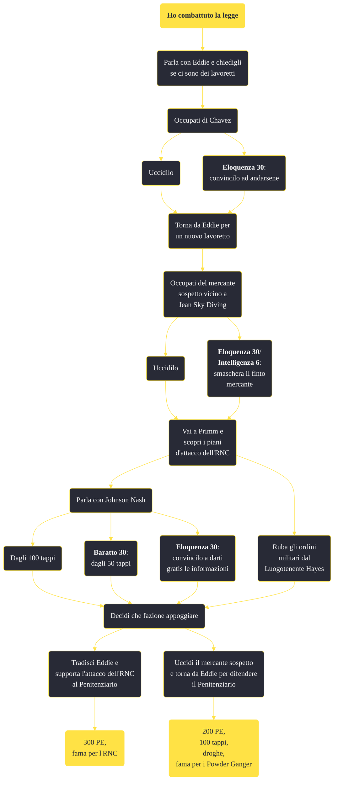

---
# Title, summary, and page position.
linktitle: "Ho combattuto la legge"
summary: ""
weight: 10
icon: message-question
icon_pack: fas

# Page metadata.
title: "Ho combattuto la legge"
date: 2022-11-15
type: book # Do not modify.
commentable: true
tags: "Missioni secondarie di Fallout: New Vegas"
hidden: true # Visibile nella sidebar
private: false # Nascosto dalle ricerche
---

*Ho combattuto la legge* è una missione secondaria di Fallout: New Vegas. È data da Eddie al Complesso Penitenziario dell'RNC.

<section class="chart-collapse">
<input type="checkbox" name="collapse2" id="handle2">
<h3 class="handle">
<label for="handle2">Clicca per mostrare il diagramma</label>
</h3>

</section>

| Tappe |       Stato        | Descrizione |
|:-----:|:------------------:| ----------- |
|                           10                          |            | Occupati di Chavez.                                                                                                                                                         |
|                           15                          |            | Di' ad Eddie che ti sei occupato di Chavez.                                                                                                                                 |
|                           20                          |            | Rintraccia il mercante sospetto e sbarazzati di lui.                                                                                                                        |
|                           25                          |            | Torna da Eddie.                                                                                                                                                             |
|                           30                          |            | Parla con gli abitanti locali di Primm e scopri, ammesso che ci sia qualcosa da scoprire, cosa sta programmando l'RNC per il complesso penitenziario.                       |
|                           35                          | :white_check_mark: | Riporta a Eddie con informazioni sull'attacco programmato dall'RNC.                                                                                                         |
|                           36                          |            | (Opzionale) Tradisci Eddie offrendo il tuo aiuto al Luogotenente Hayes per rimpossessarsi della prigione.                                                                   |
|                           40                          |            | Vai dal Sergente Lee.                                                                                                                                                       |
|                           50                          | :white_check_mark: | Uccidi Eddie.                                                                                                                                                               |
|                           55                          | :white_check_mark: | Torna da Eddie.                                                                                                                                                             |

**Sfide abilità**:
- **Eloquenza 30**: per convincere Chavez ad andarsene
- **Eloquenza 30**/**Intelligenza 6**: per smascherare il mercante a Jean Sky Diving
- **Eloquenza 30**/**Baratto 30**: per ottenere gratuitamente (o con un forte sconto) le informazioni da Johnson Nash

