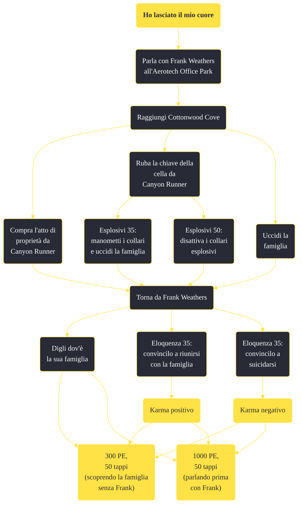

---
# Title, summary, and page position.
linktitle: "Ho lasciato il mio cuore"
summary: ""
weight: 10
icon: message-question
icon_pack: fas

# Page metadata.
title: "Ho lasciato il mio cuore"
date: 2022-11-15
type: book # Do not modify.
commentable: true
tags: "Missioni secondarie di Fallout: New Vegas"
hidden: true # Visibile nella sidebar
private: false # Nascosto dalle ricerche
---

*Ho lasciato il mio cuore* è una missione secondaria di Fallout: New Vegas. È data da Frank Weathers o dalla Sig.ra Weathers a Cottonwood Cove.

<section class="chart-collapse">
<input type="checkbox" name="collapse2" id="handle2">
<h3 class="handle">
<label for="handle2">Clicca per mostrare il diagramma</label>
</h3>

</section>

| Tappe |       Stato        | Descrizione |
|:-----:|:------------------:| ----------- |
|                           10                          |            | Trova la famiglia di Frank Weathers.                                                                                                                                        |
|                           50                          |            | Libera i Weathers dalla schiavitù.                                                                                                                                          |
|                           55                          |            | [Opzionale] 'Libera' i Weathers dalla schiavitù.                                                                                                                             |
|                          100                          | :white_check_mark: | Torna da Frank Weathers.                                                                                                                                                    |

**Sfide abilità**:
- **Eloquenza 50**: per pagare solo 150 tappi (invece di 300) per l'atto di proprietà della famiglia Weathers
- **Esplosivi 35**: per manomettere i collari e uccidere tutti
- **Esplosivi 50**: per disarmare i collari

**Note**:
- Se si vuole completare la missione dopo aver già terminato Drin drin drin!, sarà necessario aver iniziato *Date a Caesar quello che è di Caesar*, altrimenti l'opzione di dialogo con Canyon Runner non sarà disponibile
- Se il giocatore ha una reputazione mista o negativa con l'RNC, Frank sarà ostile e non sarà possibile ottenere la missione 

