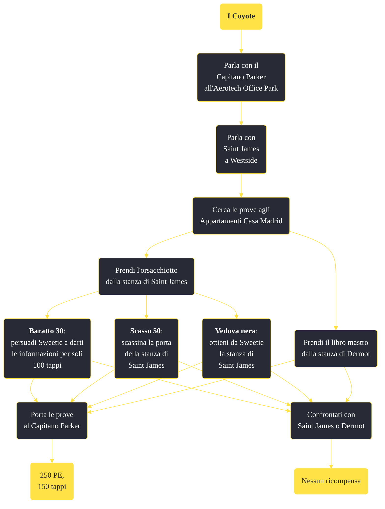

---
# Title, summary, and page position.
linktitle: "I Coyote"
summary: ""
weight: 10
icon: message-question
icon_pack: fas

# Page metadata.
title: "I Coyote"
date: 2022-11-15
type: book # Do not modify.
commentable: true
tags: "Missioni secondarie di Fallout: New Vegas"
hidden: true # Visibile nella sidebar
private: false # Nascosto dalle ricerche
---

*I Coyote* è una missione secondaria di Fallout: New Vegas. È data dal Capitano Parker all'Aerotech Office Park.

<section class="chart-collapse">
<input type="checkbox" name="collapse2" id="handle2">
<h3 class="handle">
<label for="handle2">Clicca per mostrare il diagramma</label>
</h3>

</section>

| Tappe |       Stato        | Descrizione |
|:-----:|:------------------:| ----------- |
|                           10                          |            | Dirigiti a Westside e parla con Saint James dei profughi dell'RNC scomparsi.                                                                                                |
|                           20                          |            | Perquisisci la stanza di Dermot negli Appartamenti di Casa Madrid alla ricerca di prove.                                                                                    |
|                           30                          |            | Perquisisci la stanza di Saint James negli Appartamenti di Casa Madrid alla ricerca di prove.                                                                               |
|                           40                          |            | (Opzionale) Parla con Dermot o Saint James delle prove che hai raccolto.                                                                                                    |
|                           50                          |            | (Opzionale) Uccidi Saint James e Dermot.                                                                                                                                    |
|                           60                          | :white_check_mark: | Riferisci al Capitano Parker cosa è accaduto ai profughi scomparsi.                                                                                                         |

**Sfide abilità**:
- **Scasso 50**: per scassinare la porta della stanza di Saint James
- **Vedova nera**: per ottenere la chiave della stanza di Saint James da Sweetie
- **Baratto 30**: per persuadere Sweetie con soli 100 tappi"

