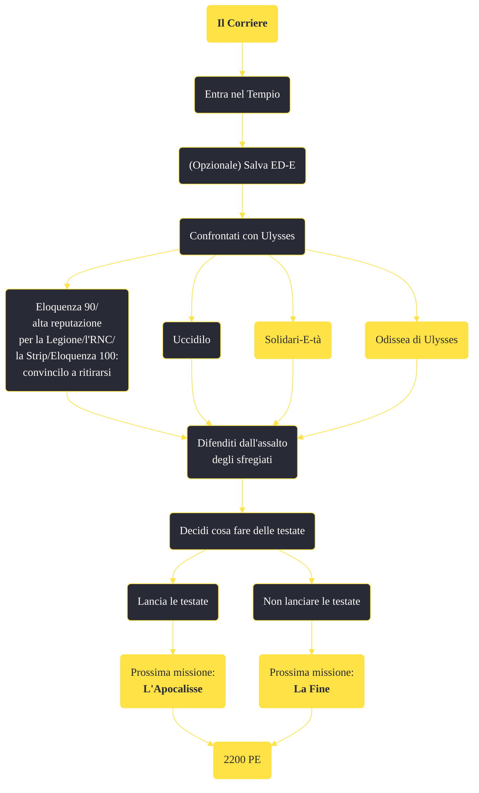

---
# Title, summary, and page position.
linktitle: "Il Corriere" 
summary: ""
weight: 10
icon: message-question
icon_pack: fas

# Page metadata.
title: "Il Corriere"
date: 2022-11-15
type: book # Do not modify.
commentable: true
tags: "Missioni di Lonesome Road"
hidden: true # Visibile nella sidebar
private: false # Nascosto dalle ricerche
---

*Il Corriere* è una missione del DLC *Lonesome Road* di Fallout: New Vegas. È data dal Pip-Boy.

<section class="chart-collapse">
<input type="checkbox" name="collapse2" id="handle2">
<h3 class="handle">
<label for="handle2">Clicca per mostrare il diagramma</label>
</h3>

</section>

| Tappe |       Stato        | Descrizione |
|:-----:|:------------------:| ----------- |
|                           10                          |            | Rintraccia Ulysses nel suo Tempio.                                                                                                                                          |
|                           20                          |            | Facoltativo: salva ED-E.                                                                                                                                                    |
|                           30                          |            | Affronta Ulysses.                                                                                                                                                           |
|                           35                          | :white_check_mark: | Combatti gli Sfregiati.                                                                                                                                                     |
|                           40                          |            | Facoltativo: disattiva gli Eyebot di Ulysses.                                                                                                                               |

**Sfide abilità**:
- **Eloquenza 90** e **alta reputazione con la Legione** o l'**RNC** o la **Strip**/**Eloquenza 100**: per affrontare pacificamente Ulysses, senza aver collezionato tutti i suoi olonastri o le schede di circuito di potenziamento Eyebot

**Note**:
- Se non è possibile evitare lo scontro, bisogna ricordare che Ulysses:
  - utilizzerà lo Stealth Boy
  - sarà in grado di curarsi e rimuovere velocemente ogni forma di menomazione
  - sarà affiancato da numerosi eyebot (disattivabili da un terminale)
  - l'intero struttura diventerà bersaglio di un assalto da parte di alcuni sfregiati

