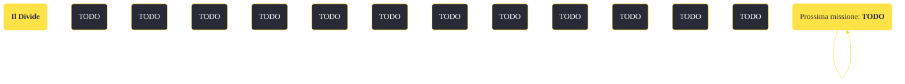

---
# Title, summary, and page position.
linktitle: "Il Divide" 
summary: ""
weight: 10
icon: message-question
icon_pack: fas

# Page metadata.
title: "Il Divide"
date: 2022-11-15
type: book # Do not modify.
commentable: true
tags: "Missioni di Lonesome Road"
hidden: true # Visibile nella sidebar
private: false # Nascosto dalle ricerche
---

*Il Divide* è una missione del DLC *Lonesome Road* di Fallout: New Vegas. È data dal Pip-Boy.

<section class="chart-collapse">
<input type="checkbox" name="collapse2" id="handle2">
<h3 class="handle">
<label for="handle2">Clicca per mostrare il diagramma</label>
</h3>

</section>

| Tappe |       Stato        | Descrizione |
|:-----:|:------------------:| ----------- |
|                           5                           |            | Attiva l'ascensore per silo missilistico di Ashton e dirigiti al Divide.                                                                                                    |
|                           7                           |            | Sopravvivi alla corsa dell'ascensore per il silo missilistico di Ashton.                                                                                                    |
|                           10                          |            | Raggiungi il tetto dell'edificio degli uffici crollato e raggiungi il Divide.                                                                                               |
|                           20                          |            | Attraversa il Divide.                                                                                                                                                       |
|                           30                          |            | Usa le caverne per superare l'edificio crollato.                                                                                                                            |
|                           50                          | :white_check_mark: | Vai al Tempio di Ulysses.                                                                                                                                                   |

**Note**:
- I dialoghi con Ulysses servono per la sfida *Come se...*

