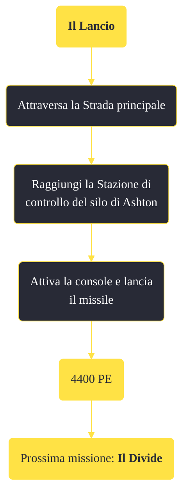

---
# Title, summary, and page position.
linktitle: "Il Lancio" 
summary: ""
weight: 10
icon: message-question
icon_pack: fas

# Page metadata.
title: "Il Lancio"
date: 2022-11-15
type: book # Do not modify.
commentable: true
tags: "Missioni di Lonesome Road"
hidden: true # Visibile nella sidebar
private: false # Nascosto dalle ricerche
---

*Il Lancio* è una missione del DLC *Lonesome Road* di Fallout: New Vegas. È data dal Pip-Boy.

**Riassunto**:
1. Attraversa la Strada principale
2. Raggiungi la Stazione di controllo del silo di Ashton
3. Attiva la console e lancia il missile
4. Ricompensa: **4400 PE**
5. Prossima missione: *Il Divide*

<section class="chart-collapse">
<input type="checkbox" name="collapse2" id="handle2">
<h3 class="handle">
<label for="handle2">Clicca per mostrare il diagramma</label>
</h3>

</section>

| Tappe |       Stato        | Descrizione |
|:-----:|:------------------:| ----------- |
|                           15                          |            | Raggiungi la stazione di controllo del silo di Ashton alla fine della Strada principale.                                                                                    |
|                           20                          | :white_check_mark: | Attiva la console per ottenere l'accesso al silo missilistico di Ashton.                                                                                                    |

**Sfide abilità**:
- **Esploratore**: per sbloccare un dialogo unico con Ulysses

