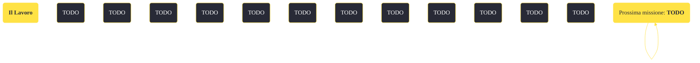

---
# Title, summary, and page position.
linktitle: "Il Lavoro" 
summary: ""
weight: 10
icon: message-question
icon_pack: fas

# Page metadata.
title: "Il Lavoro"
date: 2022-11-15
type: book # Do not modify.
commentable: true
tags: "Missioni di Lonesome Road"
hidden: true # Visibile nella sidebar
private: false # Nascosto dalle ricerche
---

*Il Lavoro* è una missione del DLC *Lonesome Road* di Fallout: New Vegas. È data dal Pip-Boy.

<section class="chart-collapse">
<input type="checkbox" name="collapse2" id="handle2">
<h3 class="handle">
<label for="handle2">Clicca per mostrare il diagramma</label>
</h3>

</section>

| Tappe |       Stato        | Descrizione |
|:-----:|:------------------:| ----------- |
|                           10                          |            | Trova il detonatore laser.                                                                                                                                                  |
|                           12                          |            | Usa il detonatore laser sulla testata.                                                                                                                                      |
|                           15                          |            | Attraversa Lonesome Road fino al tunnel del cavalcavia crollato.                                                                                                            |
|                           20                          | :white_check_mark: | Fuggi dalla caverna degli Scavatori e raggiungi la Strada principale.                                                                                                       |

**Sfide abilità**:
- **Percezione 6**/**Intelligenza 7**/**Eloquenza 55**, **75**/**Scienza 50**/**Medicina 35**/**Sopravvivenza 35**, **75**/**Esplosivi 50**: per sbloccare alcuni dialoghi unici con Ulysses

**Note**:
- I dialoghi con Ulysses servono per la sfida *Come se...*
- Dopo che ti sei impossessato del detonatore laser, compariranno 4-5 sfregiati ostili

