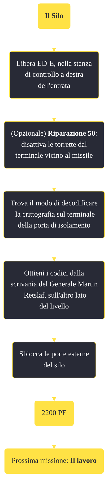

---
# Title, summary, and page position.
linktitle: "Il Silo" 
summary: ""
weight: 10
icon: message-question
icon_pack: fas

# Page metadata.
title: "Il Silo"
date: 2022-11-15
type: book # Do not modify.
commentable: true
tags: "Missioni di Lonesome Road"
hidden: true # Visibile nella sidebar
private: false # Nascosto dalle ricerche
---

*Il Silo* è una missione del DLC *Lonesome Road* di Fallout: New Vegas. È data dal Pip-Boy.

**Riassunto**:
1. Libera ED-E, nella stanza di controllo a destra dell'entrata
2. (Opzionale) **Riparazione 50**: disattiva le torrette dal terminale vicino al missile"
3. Trova il modo di decodificare  la crittografia sul terminale della porta di isolamento
4. Ottieni i codici  dalla scrivania del Generale Martin  Retslaf, sull'altro lato del livello
5. Sblocca le porte esterne del silo
6. Ricompensa: **2200 PE**
7. Prossima missione: *Il Lavoro*

<section class="chart-collapse">
<input type="checkbox" name="collapse2" id="handle2">
<h3 class="handle">
<label for="handle2">Clicca per mostrare il diagramma</label>
</h3>

</section>

| Tappe |       Stato        | Descrizione |
|:-----:|:------------------:| ----------- |
|                           10                          |            | Supera il silo missilistico di Hopeville e raggiungi Lonesome Road.                                                                                                         |
|                           20                          |            | Trova il modo di decodificare la crittografia sul terminale della porta di isolamento.                                                                                      |
|                           25                          |            | Facoltativo: fai in modo che ED-E acceda allo spaccio al posto tuo.                                                                                                         |
|                           30                          |            | Usa ED-E per decodificare la crittografia sul terminale della porta di isolamento.                                                                                          |
|                           35                          |            | Ripristina la corrente del silo.                                                                                                                                            |
|                           40                          |            | Trova i codici di sicurezza per la rete del silo missilistico.                                                                                                              |
|                           50                          |            | Usa ED-E per sbloccare il computer centrale.                                                                                                                                |
|                           55                          | :white_check_mark: | Sblocca le porte esterne del silo.                                                                                                                                          |

**Sfide abilità**:
- **Riparazione 50**: per disattivare le torrette dal terminale vicino al missile

