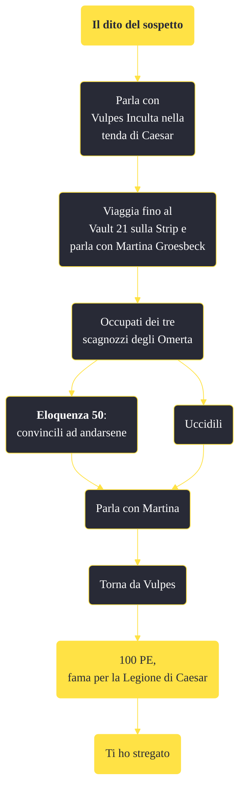

---
# Title, summary, and page position.
linktitle: "Il dito del sospetto"
summary: ""
weight: 10
icon: message-question
icon_pack: fas

# Page metadata.
title: "Il dito del sospetto"
date: 2022-11-15
type: book # Do not modify.
commentable: true
tags: "Missioni secondarie di Fallout: New Vegas"
hidden: true # Visibile nella sidebar
private: false # Nascosto dalle ricerche
---

*Il dito del sospetto* è una missione secondaria di Fallout: New Vegas. È data da Vulpes Inculta al Forte.

<section class="chart-collapse">
<input type="checkbox" name="collapse2" id="handle2">
<h3 class="handle">
<label for="handle2">Clicca per mostrare il diagramma</label>
</h3>

</section>

| Tappe |       Stato        | Descrizione |
|:-----:|:------------------:| ----------- |
|                           10                          |            | Trova Martina Groesbeck.                                                                                                                                                    |
|                           20                          |            | Elimina i delinquenti di Omerta inviati a uccidere Martina.                                                                                                                 |
|                           30                          | :white_check_mark: | Torna da Vulpes e digli che Martina è sana e salva.                                                                                                                         |
|                           40                          |   ❌  | Torna da Vulpes e digli che Martina è morta.                                                                                                                                |

**Sfide abilità**:
- **Eloquenza 50**: per convincere i sicari ad andarsene

**Note**:
- È necessario dire a Martina che è stata la Legione a mandare il Corriere per proteggerla, così da poter iniziare la missione *Ti ho stregato* parlando con Vulpes 

