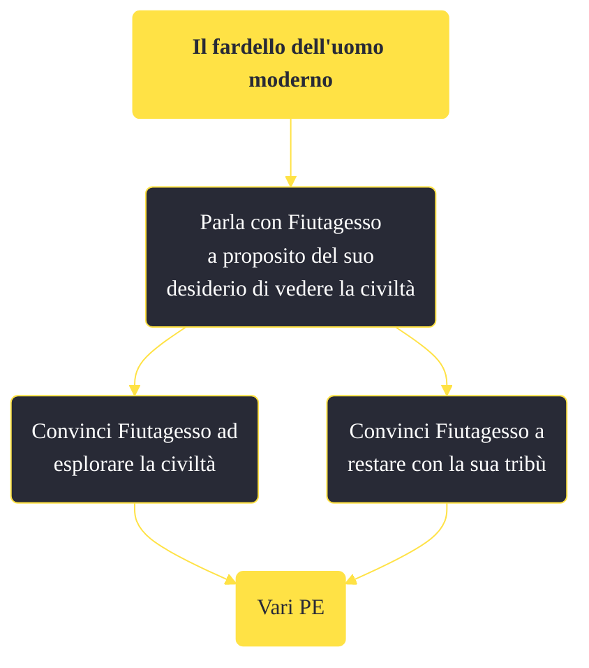

---
# Title, summary, and page position.
linktitle: "Il fardello dell'uomo moderno"
summary: ""
weight: 10
icon: message-question
icon_pack: fas

# Page metadata.
title: "Il fardello dell'uomo moderno"
date: 2022-11-15
type: book # Do not modify.
commentable: true
tags: "Missioni di Honest Hearts"
hidden: true # Visibile nella sidebar
private: false # Nascosto dalle ricerche
---

*Il fardello dell'uomo moderno* è una missione del DLC *Honest Hearts* di Fallout: New Vegas. È data da Fiutagesso all'accampamento dei Cavalli Morti.

<section class="chart-collapse">
<input type="checkbox" name="collapse2" id="handle2">
<h3 class="handle">
<label for="handle2">Clicca per mostrare il diagramma</label>
</h3>

</section>

| Tappe |       Stato        | Descrizione |
|:-----:|:------------------:| ----------- |
|                           10                          |            | Parla con Joshua Graham del desiderio di Fiutagesso di vedere la civiltà.                                                                                                   |
|                           20                          | :white_check_mark: | Di' a Fiutagesso cosa ne pensi della civiltà.                                                                                                                               |

**Note**:
- Questa missione può essere svolta in qualsiasi momento prima di completare *Portatore dei Tormenti*, anche se Fiutagesso non è più un tuo seguace; è possibile parlarci raggiungendolo alla Caverna dell'angelo

