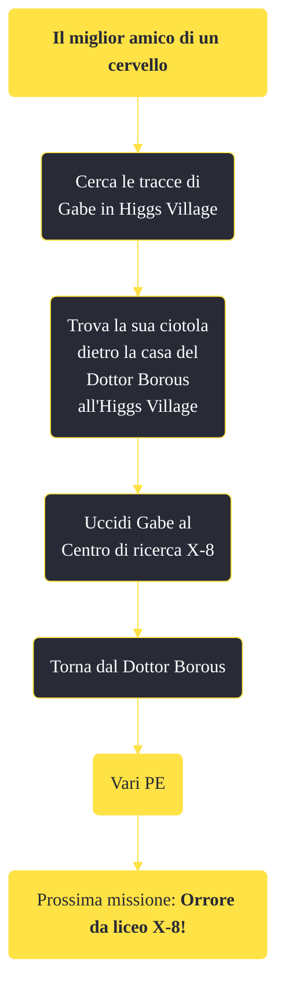

---
# Title, summary, and page position.
linktitle: "Il miglior amico di un cervello" 
summary: ""
weight: 10
icon: message-question
icon_pack: fas

# Page metadata.
title: "Il miglior amico di un cervello"
date: 2022-11-15
type: book # Do not modify.
commentable: true
tags: "Missioni di Old World Blues"
hidden: true # Visibile nella sidebar
private: false # Nascosto dalle ricerche
---

*Il miglior amico di un cervello* è una missione del DLC *Old World Blues* di Fallout: New Vegas. È data dal dottor Borous al Serbatoio del pensiero.

<section class="chart-collapse">
<input type="checkbox" name="collapse2" id="handle2">
<h3 class="handle">
<label for="handle2">Clicca per mostrare il diagramma</label>
</h3>

</section>

| Tappe |       Stato        | Descrizione |
|:-----:|:------------------:| ----------- |
|                           10                          |            | Cerca di trovare tracce di Gabe a Higgs Village.                                                                                                                            |
|                           20                          |            | Cerca altre prove su Gabe nell'X-8.                                                                                                                                         |
|                           30                          | :white_check_mark: | Riporta la ciotola di Gabe al Dr. Borous.                                                                                                                                   |

**Sfide abilità**:
- **Eloquenza 45**/**Amico degli animali**: per persuadere il Dottor Borous a convincere il Dottor Klein ad abbandonare il suo piano di lasciare Big MT

**Note**:
- Questa è una delle missioni che se completata può aiutare a terminare il DLC in maniera pacifica

