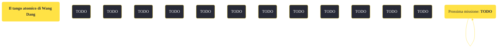

---
# Title, summary, and page position.
linktitle: "Il tango atomico di Wang Dang"
summary: ""
weight: 10
icon: message-question
icon_pack: fas

# Page metadata.
title: "Il tango atomico di Wang Dang"
date: 2022-11-15
type: book # Do not modify.
commentable: true
tags: "Missioni secondarie di Fallout: New Vegas"
hidden: true # Visibile nella sidebar
private: false # Nascosto dalle ricerche
---

*Il tango atomico di Wang Dang* è una missione secondaria di Fallout: New Vegas. È data da James Garret all'Atomic Wrangler di Freeside.

<section class="chart-collapse">
<input type="checkbox" name="collapse2" id="handle2">
<h3 class="handle">
<label for="handle2">Clicca per mostrare il diagramma</label>
</h3>

</section>

| Tappe |       Stato        | Descrizione |
|:-----:|:------------------:| ----------- |
|                           10                          |            | Recluta un sexbot.                                                                                                                                                          |
|                           14                          |            | Il sexbot è stato distrutto.                                                                                                                                                |
|                           15                          |            | Riferisci a James Garret che Fisto entrerà a far parte del Wrangler.                                                                                                        |
|                           20                          |            | Recluta un oratore diplomatico.                                                                                                                                             |
|                           24                          |            | Gli oratori diplomatici adatti sono morti.                                                                                                                                  |
|                           25                          |            | Riferisci a James Garret che Santiago entrerà a far parte del Wrangler.                                                                                                     |
|                           27                          |            | Riferisci a James Garret che Old Ben entrerà a far parte del Wrangler.                                                                                                      |
|                           30                          |            | Recluta un vero cowboy ghoul.                                                                                                                                               |
|                           34                          |            | Il cowboy ghoul è morto.                                                                                                                                                    |
|                           35                          |            | Riferisci a James Garret che Beatrix entrerà a far parte del Wrangler.                                                                                                      |
|                           50                          | :white_check_mark: | Torna da James Garret.                                                                                                                                                      |

**Sfide abilità**:
- **Eloquenza 35**/**Baratto 35**: per convincere Beatrix a lavorare all'Atomic Wrangler
- **Eloquenza 50**/**Uno scapolo incallito**/**Vedova nera**: per convincere il Vecchio Ben a lavorare all'Atomic Wrangler
- **Scienza 50**, **60**: per riattivare e riprogrammare Fisto

**Note**:
- Se il Corriere ha una cattiva reputazione con Freeside, è impossibile completare la missione attraverso l'uso dell'olodisco su Fisto

