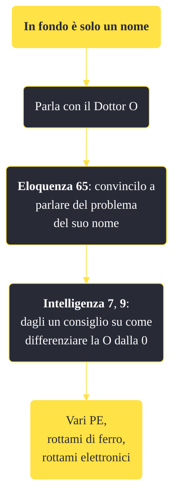

---
# Title, summary, and page position.
linktitle: "In fondo è solo un nome" 
summary: ""
weight: 10
icon: message-question
icon_pack: fas

# Page metadata.
title: "In fondo è solo un nome"
date: 2022-11-15
type: book # Do not modify.
commentable: true
tags: "Missioni di Old World Blues"
hidden: true # Visibile nella sidebar
private: false # Nascosto dalle ricerche
---

*In fondo è solo un nome* è una missione del DLC *Old World Blues* di Fallout: New Vegas. È data dal dottor O al Serbatoio del pensiero.

**Riassunto**:
1. Parla con il Dottor O
2. **Eloquenza 65**: convincilo a parlare del problema del suo nome 
3. **Intelligenza 7**, **9**: dagli un consiglio su come differenziare la O dalla 0
4. Ricompensa: **vari PE**, **rottami di ferro**, **rottami elettronici**

<section class="chart-collapse">
<input type="checkbox" name="collapse2" id="handle2">
<h3 class="handle">
<label for="handle2">Clicca per mostrare il diagramma</label>
</h3>

</section>

| Tappe |       Stato        | Descrizione |
|:-----:|:------------------:| ----------- |
|                           10                          | :white_check_mark: | Cerca di risolvere il problema del nome di O.                                                                                                                               |

**Sfide abilità**:
- **Eloquenza 65**: per discutere con il Dottor O a proposito del suo nome
- **Intelligenza 7**, **9**: per differenziare la O con lo 0

**Note**:
- Questa è una delle missioni che se completata può aiutare a terminare il DLC in maniera pacifica

