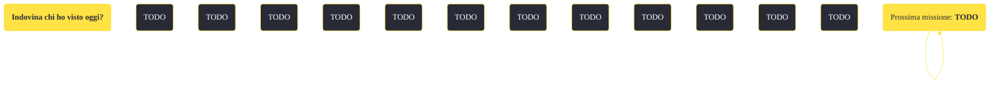

---
# Title, summary, and page position.
linktitle: "Indovina chi ho visto oggi?"
summary: ""
weight: 10
icon: message-question
icon_pack: fas

# Page metadata.
title: "Indovina chi ho visto oggi?"
date: 2022-11-15
type: book # Do not modify.
commentable: true
tags: "Missioni secondarie di Fallout: New Vegas"
hidden: true # Visibile nella sidebar
private: false # Nascosto dalle ricerche
---

*Indovina chi ho visto oggi?* è una missione secondaria di Fallout: New Vegas. È data dal Dottor Henry a Jacobstown.

<section class="chart-collapse">
<input type="checkbox" name="collapse2" id="handle2">
<h3 class="handle">
<label for="handle2">Clicca per mostrare il diagramma</label>
</h3>

</section>

| Tappe |       Stato        | Descrizione |
|:-----:|:------------------:| ----------- |
|                           10                          |            | Cerca l'origine della mutazione del campo furtivo dei Nightstalker.                                                                                                         |
|                           15                          |            | (Opzionale) Chiedi a Lily di aiutarti a indagare sulle mutazioni dei Nightstalker.                                                                                          |
|                           16                          |            | Mantieni Lily in vita.                                                                                                                                                      |
|                           20                          |            | Di' al Dottor Henry che hai scoperto una possibile causa delle mutazioni dei Nightstalker.                                                                                  |
|                           30                          |            | Parla con Lily della partecipazione all'esperimento del Dottor Henry.                                                                                                       |
|                           40                          |            | Di' al Dottor Henry di procedere con l'esperimento quando è presente Lily.                                                                                                  |
|                           50                          |            | Aspetta il Dottor Henry per completare l'esperimento.                                                                                                                       |
|                           60                          |            | Parla con Keene e cerca di tranquillizzare la situazione.                                                                                                                   |
|                           65                          |            | Uccidi il Nightkin ostile.                                                                                                                                                  |
|                           70                          |            | Parla con il Dottor Henry.                                                                                                                                                  |
|                           80                          | :white_check_mark: | Decidi se è bene che Lily continui a indossare il prototipo di Mark II e informa il Dottor Henry.                                                                           |

**Sfide abilità**:
- **Eloquenza 80**: per convincere Keene ad andarsene senza spargimenti di sangue
- **Scienza 90**: per convincere il Dottor Henry a testare gli Stealth Boy Mk II sui nightstalker

**Note**:
- Questa missione non può essere terminata se si è già completata *Valzer delle candele*, poiché il Dott. Henry non sarà più disponibile 

