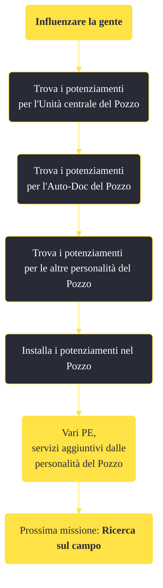

---
# Title, summary, and page position.
linktitle: "Influenzare la gente" 
summary: ""
weight: 10
icon: message-question
icon_pack: fas

# Page metadata.
title: "Influenzare la gente"
date: 2022-11-15
type: book # Do not modify.
commentable: true
tags: "Missioni di Old World Blues"
hidden: true # Visibile nella sidebar
private: false # Nascosto dalle ricerche
---

*Influenzare la gente* è una missione del DLC *Old World Blues* di Fallout: New Vegas. È data dal Pozzo.

**Riassunto**:
1. Trova i potenziamenti per l'Unità centrale del Pozzo
2. Trova i potenziamenti per l'Auto-Doc del Pozzo
3. Trova i potenziamenti per le altre personalità del Pozzo
4. Installa i potenziamenti nel Pozzo
5. Ricompensa: **vari PE**, servizi aggiuntivi dalle personalità del Pozzo
6. Prossima missione: *Ricerca sul campo*

<section class="chart-collapse">
<input type="checkbox" name="collapse2" id="handle2">
<h3 class="handle">
<label for="handle2">Clicca per mostrare il diagramma</label>
</h3>

</section>

| Tappe |       Stato        | Descrizione |
|:-----:|:------------------:| ----------- |
|                           10                          |            | Trova i potenziamenti per l'Unità centrale del Pozzo.                                                                                                                       |
|                           20                          |            | Trova i potenziamenti per l'Auto-Doc del Pozzo.                                                                                                                             |
|                           30                          |            | Trova i potenziamenti per le IA di supporto del Pozzo.                                                                                                                      |
|                           40                          | :white_check_mark: | Installa i potenziamenti nel Pozzo.                                                                                                                                         |

**Sfide abilità**:
- ?

**Note**:
- Potenziamenti per l'Unità centrale del Pozzo:
  - **Mod LAER - Caricatore di munizioni ausiliario**, su un ripiano di una stanza laterale all'interno Tunnel occidentale di Big MT
  - **Mod LAER - Lenti prismatiche**, sul tetto del Trasmettitore Signal Hills
  - **Mod K9000- Rosicchia Mentat e Mod K9000- Rorina ri Resla**, su due terminali della Struttura di ricerca X-13
- Potenziamenti per l'Auto-Doc del Pozzo
  - **Potenziamento Auto-Doc: Miglioramenti di acconciature**, su una scrivania all'interno dell'ufficio del Trasmettitore Signal Hills
  - **Potenziamento Auto-Doc: Miglioramenti di estetica**, in un armadietto su una passerella al primo piano dell'Edificio medico Y-17
  - **Potenziamento Auto-Doc: Impianto C-13**, all'angolo sudovest della stanza principale al piano terra dell'Edificio medico Y-17
  - **Potenziamento Auto-Doc: Impianto M-5**, sul tavolo operatorio della stanza con il Campione 73 nel Laboratorio di ibridazione del DNA Pepsinae Z-14
  - **Potenziamento Auto-Doc: Impianto Y-3**, sul tavolo operatorio della stanza con Shadis nel Laboratorio di preservazione del DNA Crotalus Z-9
  - **Potenziamento Auto-Doc: Impianto Y-7**, in un terminale della Struttura di ricerca X-13
- Potenziamenti per le altre personalità del Pozzo
  - **Potenziamento del Lavello: Produzione di acqua**, assieme ad uno scheletro e vicino a un bulldozer al Sito di costruzione
  - **Potenziamento "Muggy": Produzione parti**, sul rottame di 010011110110111001100101 all'Impianto di decostruzione Securitron
  - **Potenziamento dell'Interruttore della luce 01: "Luci intelligenti"**, appoggiato ad un proiettore al piano terra del Centro di ricerca X-12 (necessita di un emettitore sonoro potenziato)
  - **Potenziamento dell'Interruttore della luce 02: "Luci emozionali"**, in un armadietto della stanza grande della Struttura di ricerca della lega del saturnite
  - **Potenziamento Iconoclasta: Pacciame**, nella torre d'osservazione al Piccolo Yangtze
- È necessario aver completato *Potenziamento dell'emettitore sonoro* per ottenere tutti i potenziamenti

