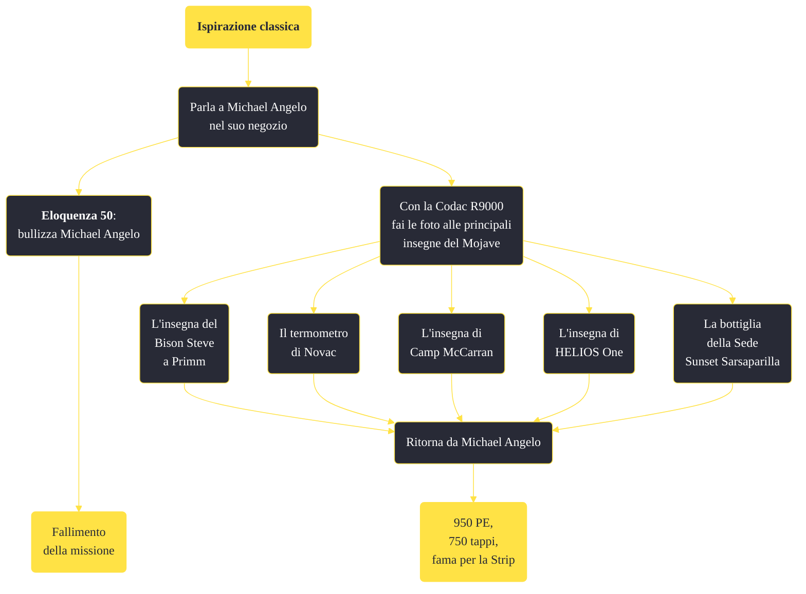

---
# Title, summary, and page position.
linktitle: "Ispirazione classica"
summary: ""
weight: 10
icon: message-question
icon_pack: fas

# Page metadata.
title: "Ispirazione classica"
date: 2022-11-15
type: book # Do not modify.
commentable: true
tags: "Missioni secondarie di Fallout: New Vegas"
hidden: true # Visibile nella sidebar
private: false # Nascosto dalle ricerche
---

*Ispirazione classica* è una missione secondaria di Fallout: New Vegas. È data da Michael Angelo al laboratorio di Michael Angelo.

<section class="chart-collapse">
<input type="checkbox" name="collapse2" id="handle2">
<h3 class="handle">
<label for="handle2">Clicca per mostrare il diagramma</label>
</h3>

</section>

| Tappe |       Stato        | Descrizione |
|:-----:|:------------------:| ----------- |
|                           10                          |            | Michael Angelo vuole delle fotografie di insegne famose di New Vegas.                                                                                                       |
|                           20                          |            | Fai una foto al Termometro Dinosauro di Novac.                                                                                                                              |
|                           30                          |            | Fai una foto al cartello del Bison Steve.                                                                                                                                   |
|                           40                          |            | Fai una foto al cartello dell'Aeroporto di McCarran.                                                                                                                        |
|                           50                          |            | Fai una foto al cartello di Helios One.                                                                                                                                     |
|                           60                          |            | Fai una foto al cartello della bottiglia della sede della Sunset Sarsaparilla.                                                                                              |
|                           70                          | :white_check_mark: | Torna da Michael Angelo per la tua ricompensa.                                                                                                                              |
|                           80                          |   ❌  | Michael Angelo è morto. Non potrai più aiutarlo.                                                                                                                            |

**Sfide abilità**:
- **Eloquenza 50**: per tormentare Angelo ed estorcergli altri tappi (rendendo irrealizzabile la missione)

**Note**:
- Se Sarah muore prima o durante lo svolgimento della missione, questa fallirà e Michael si rifiuterà di dialogare con il Corriere 

