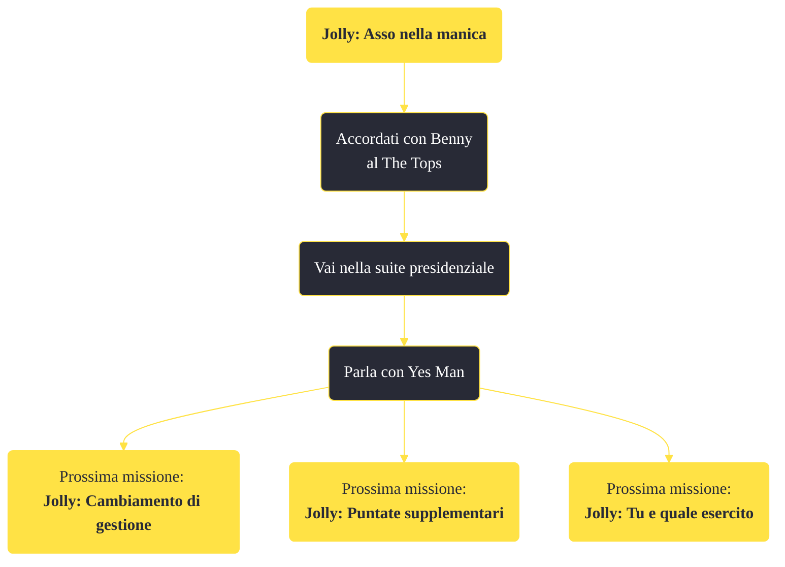

---
# Title, summary, and page position.
linktitle: "Jolly: Asso nella manica"
summary: ""
weight: 10
icon: message-question
icon_pack: fas

# Page metadata.
title: "Jolly: Asso nella manica"
date: 2022-11-15
type: book # Do not modify.
commentable: true
tags: "Missioni principali di Fallout: New Vegas"
hidden: true # Visibile nella sidebar
private: false # Nascosto dalle ricerche
---

*Jolly Asso nella manica* è una missione principale di Fallout: New Vegas. È data da Yes Man al The Tops.

<section class="chart-collapse">
<input type="checkbox" name="collapse2" id="handle2">
<h3 class="handle">
<label for="handle2">Clicca per mostrare il diagramma</label>
</h3>

</section>

| Tappe |       Stato        | Descrizione                                                        |
| :---: | :----------------: | ------------------------------------------------------------------ |
|   1   |                    | Perquisisci la stanza di Benny al The Tops alla ricerca di indizi. |
|   5   | :white_check_mark: | Parla con Yes Man su come prendere il controllo di Vegas.          |

**Sfide abilità**:
- **Eloquenza 60**: per convincere Benny a darci le informazioni necessarie

