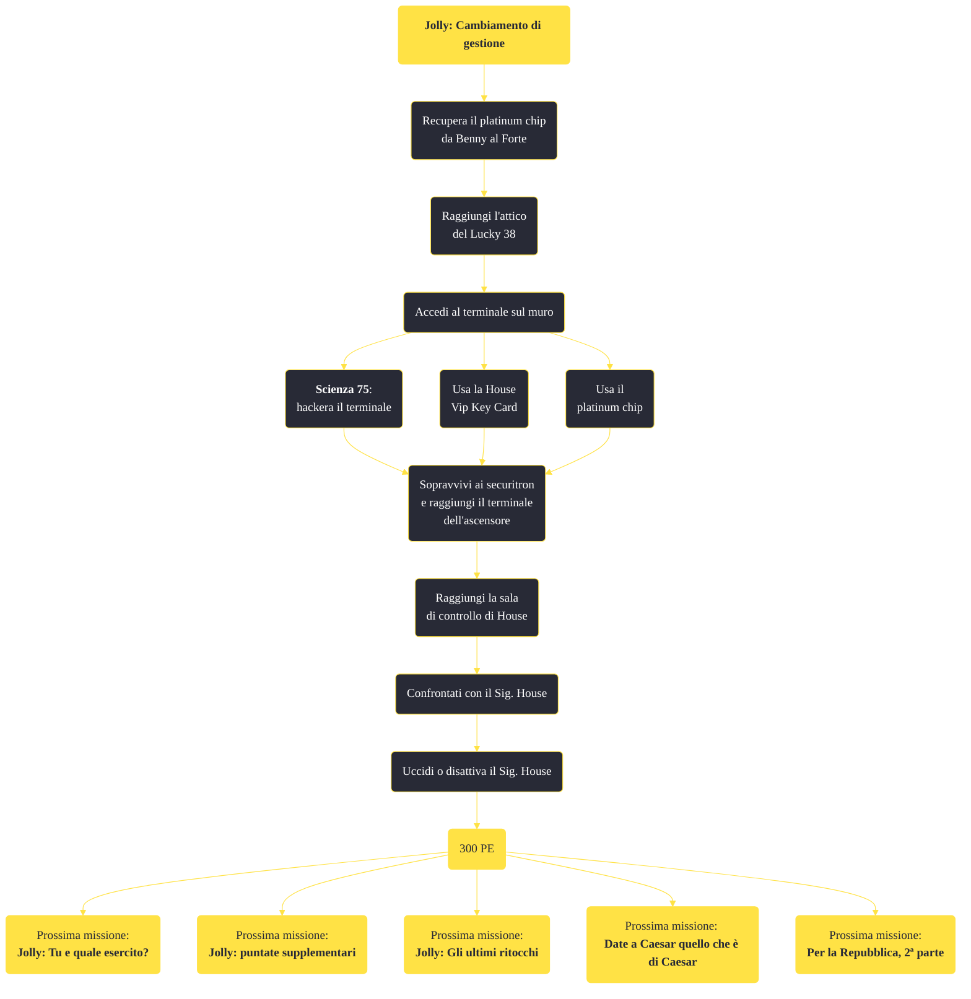

---
# Title, summary, and page position.
linktitle: "Jolly: Cambiamento di gestione"
summary: ""
weight: 10
icon: message-question
icon_pack: fas

# Page metadata.
title: "Jolly: Cambiamento di gestione"
date: 2022-11-15
type: book # Do not modify.
commentable: true
tags: "Missioni principali di Fallout: New Vegas"
hidden: true # Visibile nella sidebar
private: false # Nascosto dalle ricerche
---

*Jolly: Cambiamento di gestione* è una missione principale di Fallout: New Vegas. È data da Yes Man al Lucky 38.

**Riassunto**:
1. Recupera il platinum chip da Benny al Forte
2. Raggiungi l'attico del Lucky 38
3. Accedi al terminale sul muro
   - **Scienza 75**: hackera il terminale
   - Usa la House Vip Key Card
   - Usa il platinum chip
4. Sopravvivi ai securitron e raggiungi il terminale dell'ascensore
5. Raggiungi la sala di controllo di House
6. Confrontati con il Sig. House
7.  Uccidi o disattiva  il Sig. House
8.  Ricompensa: **300 PE**
9.  Prossime missioni: *Jolly: Tu e quale esercito?*, *Jolly: puntate supplementari*, *Jolly: Gli ultimi ritocchi*, *Date a Caesar quello che è di Caesar*, *Per la Repubblica, 2ª parte*

<section class="chart-collapse">
<input type="checkbox" name="collapse2" id="handle2">
<h3 class="handle">
<label for="handle2">Clicca per mostrare il diagramma</label>
</h3>

</section>

| Tappe |       Stato        | Descrizione                                                                                      |
| :---: | :----------------: | ------------------------------------------------------------------------------------------------ |
|  10   |                    | Recupera il Platinum Chip da Benny.                                                              |
|  15   |                    | Recupera il Platinum Chip da Benny al Forte.                                                     |
|  25   |                    | Consegna il Platinum Chip al Sig. House per permettergli di potenziare i suoi sistemi difensivi. |
|  30   |                    | Vai nello scantinato del Lucky 38.                                                               |
|  34   | :white_check_mark: | Osserva il potenziamento dei Securitron.                                                         |
|  36   |                    | Torna da Yes Man.                                                                                |
|  50   |                    | Uccidi o metti fuori combattimento il Sig. House.                                                |
|  55   |                    | Ottieni la Lucky 38 VIP Keycard.                                                                 |
|  60   |                    | Incontra Yes Man al Lucky 38.                                                                    |
|  70   | :white_check_mark: | Installa l'intelligenza artificiale di Yes Man nel computer centrale del Lucky 38.               |

**Sfide abilità**:
- **Scienza 75**: per sbloccare il terminale, senza usare la House VIP Key Card o il Platinum Chip

**Note**:
- Nel gioco sono presenti due House VIP Key Card: una si trova alla Fabbrica Strumenti H&H, l'altra nell'Abitazione di House a Camp Golf)
- È possibile completare questa missione assieme a *Per la Repubblica, 2ª parte* e *Date a Caesar quello che è di Caesar*, senza però completare *Jolly: puntate supplementari*, altrimenti l'RNC e la Legione diventeranno ostili

