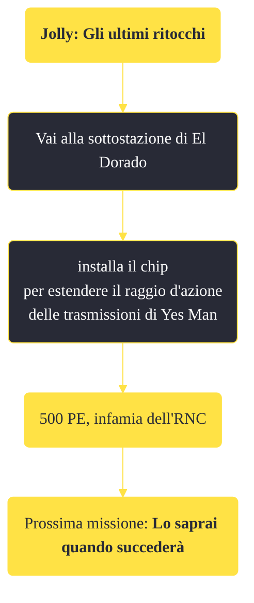

---
# Title, summary, and page position.
linktitle: "Jolly: Gli ultimi ritocchi"
summary: ""
weight: 10
icon: message-question
icon_pack: fas

# Page metadata.
title: "Jolly: Gli ultimi ritocchi"
date: 2022-11-15
type: book # Do not modify.
commentable: true
tags: "Missioni principali di Fallout: New Vegas"
hidden: true # Visibile nella sidebar
private: false # Nascosto dalle ricerche
---

*Jolly: Gli ultimi ritocchi* è una missione principale di Fallout: New Vegas. È data da Yes Man al Lucky 38.

<section class="chart-collapse">
<input type="checkbox" name="collapse2" id="handle2">
<h3 class="handle">
<label for="handle2">Clicca per mostrare il diagramma</label>
</h3>

</section>

| Tappe |       Stato        | Descrizione |
|:-----:|:------------------:| ----------- |
|                           75                          |            | (Opzionale) Proteggi il Presidente Kimball durante la sua visita ufficiale a Hoover Dam prima di alimentare la Sottostazione El Dorado.                                     |
|                           77                          |            | La visita del Presidente Kimball è stata cancellata. Vai alla sottostazione di El Dorado e installa il chip a comandi manuali.                                              |
|                           80                          |            | Vai alla centrale elettrica di El Dorado e installa il chip comandi manuali.                                                                                                |
|                           85                          |            | Incontra il Securitron all'esterno della Sottostazione El Dorado e seguilo.                                                                                                 |
|                           86                          |            | (Opzionale) Convinci i Seguaci dell'Apocalisse a sostenere una New Vegas indipendente.                                                                                      |
|                           90                          | :white_check_mark: | Fai rapporto a Yes Man al Lucky 38.                                                                                                                                         |
|                          100                          |            | Vai a Hoover Dam.                                                                                                                                                           |

**Sfide abilità**:
- 

**Note**:
- È possibile assistere al discorso di Kimball soltanto se il Corriere ha una buona reputazione con l'RNC
- Per ottenere l'appoggio dei Seguaci dell'Apocalisse è necessario essere idolatrati da questa fazione (donando molti medicinali ed diventando membro della fazione)
- A meno che non si indossi un'armatura RNC, Boone abbandonerà il Corriere (se è un suo seguace), non appena installerà il chip; se invece si ha già terminato la sua missione personale, Boone non abbandonerà il Corriere
  - Anche se sei idolatrato dall'RNC, la missione *Lo saprai quando succederà* fallirà se andrai prima alla sottostazione. Completare prima *Lo saprai quando succederà* e poi recarsi alla sottostazione, garantirà al Corriere una fama neutrale o alta per l'RNC
- Completare la parte opzionale per i Seguaci dell'Apocalisse non influirà sul filmato finale dedicato a loro

