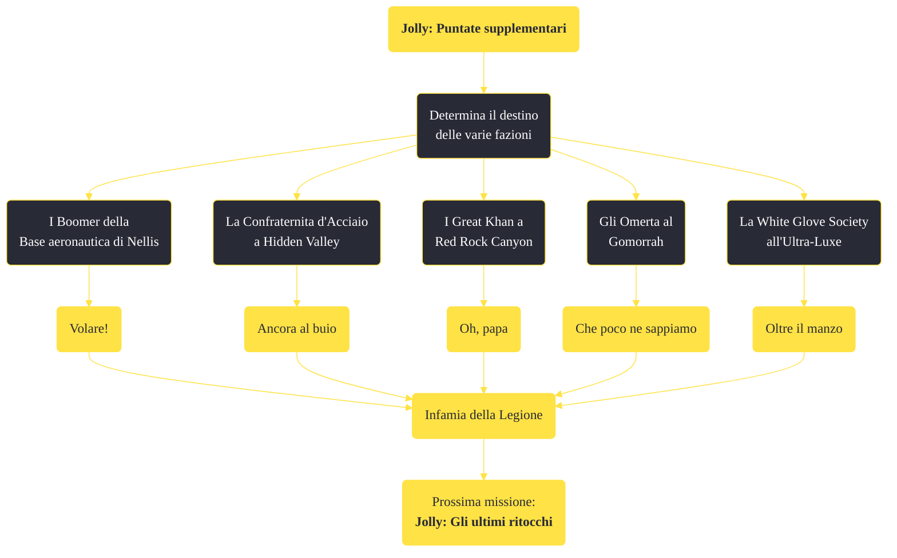

---
# Title, summary, and page position.
linktitle: "Jolly: Puntate supplementari"
summary: ""
weight: 10
icon: message-question
icon_pack: fas

# Page metadata.
title: "Jolly: Puntate supplementari"
date: 2022-11-15
type: book # Do not modify.
commentable: true
tags: "Missioni principali di Fallout: New Vegas"
hidden: true # Visibile nella sidebar
private: false # Nascosto dalle ricerche
---

*Jolly: Puntate supplementari* è una missione principale di Fallout: New Vegas. È data da Yes Man alla Strip.

<section class="chart-collapse">
<input type="checkbox" name="collapse2" id="handle2">
<h3 class="handle">
<label for="handle2">Clicca per mostrare il diagramma</label>
</h3>

</section>

| Tappe |       Stato        | Descrizione |
|:-----:|:------------------:| ----------- |
|                           20                          |            | "Indaga" sui Boomer alla base aeronautica di Nellis.                                                                                                                        |
|                           22                          | :white_check_mark: | Di' a Yes Man che i Boomer hanno giurato di aiutarti.                                                                                                                       |
|                           24                          |            | (Opzionale) Uccidi l'altro capo dei Boomer per far sì che non siano più una minaccia.                                                                                       |
|                           26                          |            | Di' a Yes Man che hai ucciso i capi dei Boomer.                                                                                                                             |
|                           28                          |            | (Opzionale) Di' a Yes Man che i Boomer possono essere ignorati.                                                                                                             |
|                           40                          |            | "Indaga" sui Great Khan nel Red Rock Canyon.                                                                                                                                |
|                           42                          |            | (Opzionale) Ritorna da Yes Man e digli che ignorerai i Great Khan.                                                                                                          |
|                           44                          |            | Informa Yes Man che hai convinto i Great Khan a supportare l'RNC.                                                                                                           |
|                           46                          |            | Informa Yes Man che i Great Khan sono stati spazzati via.                                                                                                                   |
|                           48                          | :white_check_mark: | Informa Yes Man che hai convinto i Great Khan a lasciare il Mojave.                                                                                                         |
|                           50                          |            | Informa Yes Man che i Great Khan metteranno in atto un attacco suicida a Hoover Dam.                                                                                        |
|                           60                          |            | "Indaga" sugli Omerta al Gomorrah.                                                                                                                                          |
|                           62                          |            | (Opzionale) Dì a Yes Man che hai visitato il Gomorra e vuoi ignorare gli Omerta.                                                                                            |
|                           68                          |            | Informa Yes Man che gli Omerta ti sono ostili.                                                                                                                              |
|                           70                          | :white_check_mark: | Informa Yes Man che gli Omerta non sono più una minaccia.                                                                                                                   |
|                           75                          |            | Informa Yes Man che approvi il piano degli Omerta di attaccare The Strip.                                                                                                   |
|                           80                          |            | "Indaga" sulla White Glove Society.                                                                                                                                         |
|                           81                          |            | Informati sulla White Glove Society parlando con uno dei suoi leader.                                                                                                       |
|                           82                          |            | (Opzionale) Scopri di più sulla White Glove Society parlando con Marjorie.                                                                                                  |
|                           83                          |            | (Opzionale) Scopri di più sulla White Glove Society parlando con Mortimer.                                                                                                  |
|                           84                          |            | (Opzionale) Dì a Yes Man che hai deciso di ignorare la White Glove Society.                                                                                                 |
|                           86                          |            | Informa Yes Man che hai ucciso il capo della White Glove Society.                                                                                                           |
|                           88                          |            | Informa Yes Man che hai sistemato il problema di cannibalismo della White Glove Society.                                                                                    |
|                           90                          |            | Informa Yes Man che tutto va bene con la White Glove Society.                                                                                                               |
|                           92                          | :white_check_mark: | Dì a Yes Man che hai convinto la White Glove Society a supportare la Legione di Caesar.                                                                                     |
|                          100                          |            | "Indaga" sulla Confraternita d'Acciaio.                                                                                                                                     |
|                          101                          |            | (Opzionale) Ritorna al bunker della Confraternita d'Acciaio alla Hidden Valley.                                                                                             |
|                          102                          |            | (Opzionale) Dì a Yes Man che conosci la Confraternita d'Acciaio e che desideri ignorarli.                                                                                   |
|                          103                          |            | Distruggi il bunker della Confraternita d'Acciaio.                                                                                                                          |
|                          104                          | :white_check_mark: | Informa Yes Man che hai convinto la Confraternita d'Acciaio ad aiutare l'RNC.                                                                                               |
|                          106                          |            | Informa Yes Man che hai distrutto il bunker della Confraternita d'Acciaio.                                                                                                  |

**Note**:
- Il Corriere ha l'opzione di dire a Yes Man di ignorare alcune o tutte le fazioni. Il minimo indispensabile da fare è:
  - parlare con la receptionist degli Omerta nel Gomorra
  - parlare con Mortimer a proposito della White Gloves Society
  - parlare con Pearl, a Nellis, per i Boomer
  - scoprire Red Rock Canyon, dove si sono accampati i Great Khan
  - attaccare i Paladini all'entrata del Bunker della Confraternita d'Acciaio (e sottrarre velocemente la chiave d'ingresso) o entrare grazie a Veronica e parlare con Ramos
- È possibile far stringere un'alleanza fra la Confraternita e l'RNC solo se McNamara è ancora l'anziano capo della Confraternita

