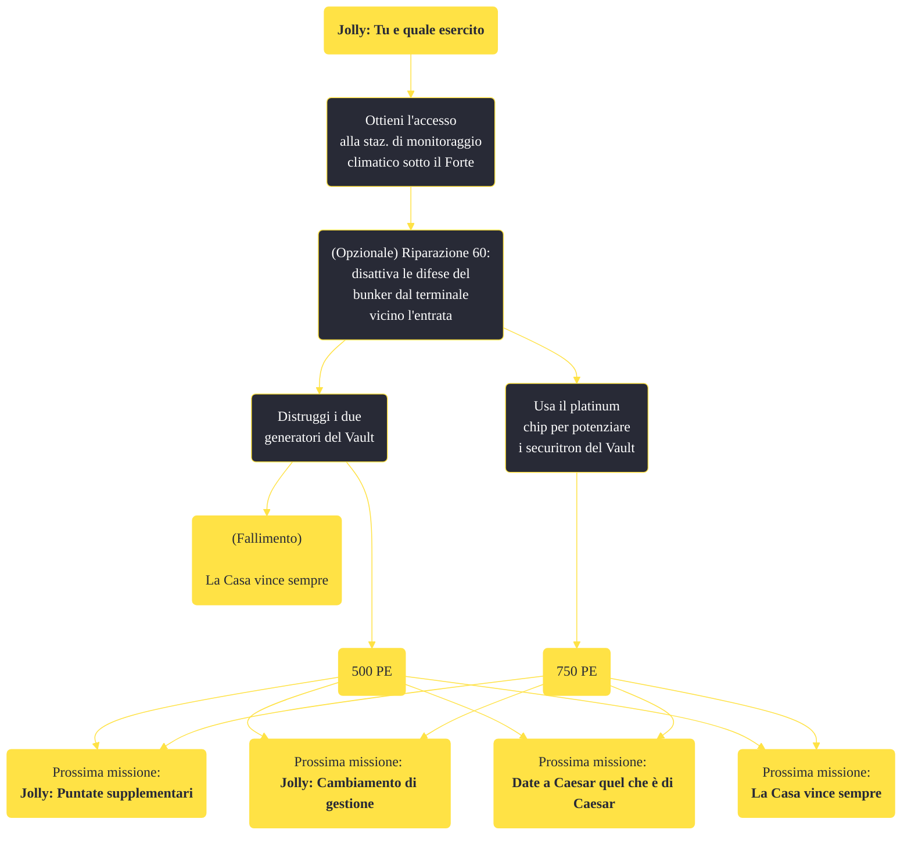

---
# Title, summary, and page position.
linktitle: "Jolly: Tu e quale esercito"
summary: ""
weight: 10
icon: message-question
icon_pack: fas

# Page metadata.
title: "Jolly: Tu e quale esercito"
date: 2022-11-15
type: book # Do not modify.
commentable: true
tags: "Missioni principali di Fallout: New Vegas"
hidden: true # Visibile nella sidebar
private: false # Nascosto dalle ricerche
---

*Jolly: Tu e quale esercito* è una missione principale di Fallout: New Vegas. È data da Yes Man al Forte.

**Riassunto**:
1. Ottieni l'accesso alla staz. di monitoraggio climatico sotto il Forte
2. (Opzionale) Riparazione 60: disattiva le difese del bunker dal terminale vicino l'entrata
   - Distruggi i due generatori del Vault: **500 PE**, (fallimento) *La Casa vince sempre*
   - Usa il platinum chip per potenziare i securitron del Vault: **750 PE**
3. Prossime missioni: *Jolly: Puntate supplementari*, *Jolly: Cambiamento di gestione*, *Date a Caesar quel che è di Caesar*, *La Casa vince sempre*

<section class="chart-collapse">
<input type="checkbox" name="collapse2" id="handle2">
<h3 class="handle">
<label for="handle2">Clicca per mostrare il diagramma</label>
</h3>

</section>

| Tappe |       Stato        | Descrizione |
|:-----:|:------------------:| ----------- |
|                           40                          |            | (Opzionale) Vai al Forte e penetra nel bunker nascosto del Sig. House.                                                                                                      |
|                           43                          |            | Esplora il bunker.                                                                                                                                                          |
|                           45                          | :white_check_mark: | (Opzionale) Potenzia l'esercito dei Securitron, per usarlo successivamente per i tuoi scopi.                                                                                |
|                           48                          | :white_check_mark: | (Opzionale) Distruggi l'esercito di Securitron.                                                                                                                             |

**Sfide abilità**:
- 

**Note**:
- "All'interno del Vault c'è una costante radiazione di +1 RAD
- Disattivare i reattori farà fallire la missione *La Casa vince sempre*
- Se il Corriere vuole allearsi con l'RNC ma lavora già per Yes Man, la missione *Per la Repubblica* si attiverà in ogni caso; se si fanno ulteriori missioni per Yes Man o il Sig. House, tutte le missioni per l'RNC falliranno e tutti i soldati RNC diventeranno ostili 
- Se si distrugge il bunker, non si avrà l'enorme aiuto dell'esercito dei Securitron nella missione finale *Niente dei, niente padroni*, quindi se si ha intenzione di aiutare Yes Man, non è consigliabile distruggerlo

