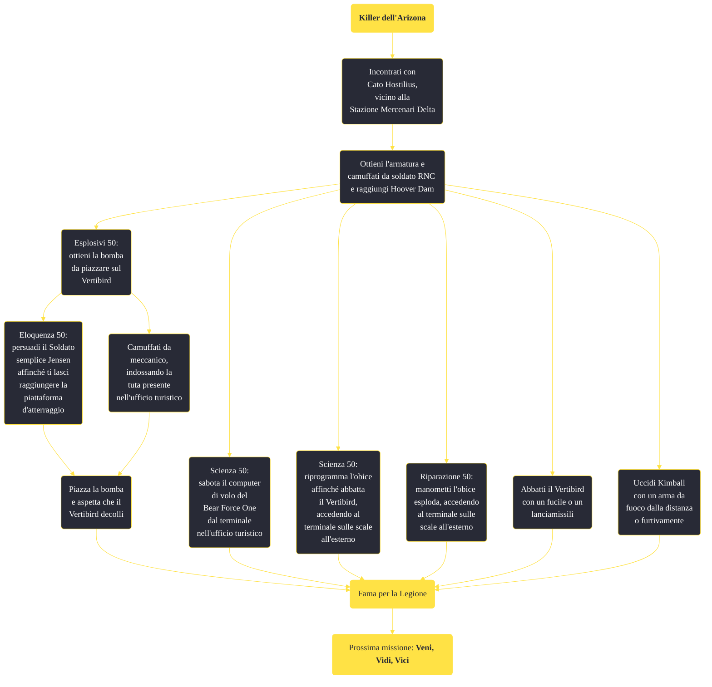

---
# Title, summary, and page position.
linktitle: "Killer dell'Arizona"
summary: ""
weight: 10
icon: message-question
icon_pack: fas

# Page metadata.
title: "Killer dell'Arizona"
date: 2022-11-15
type: book # Do not modify.
commentable: true
tags: "Missioni principali di Fallout: New Vegas"
hidden: true # Visibile nella sidebar
private: false # Nascosto dalle ricerche
---

*Killer dell'Arizona* è una missione principale di Fallout: New Vegas. È data da Caesar o da Lucius al Forte.

<section class="chart-collapse">
<input type="checkbox" name="collapse2" id="handle2">
<h3 class="handle">
<label for="handle2">Clicca per mostrare il diagramma</label>
</h3>

</section>

| Tappe |       Stato        | Descrizione |
|:-----:|:------------------:| ----------- |
|                           10                          |            | Incontrati con Cato Hostilius                                                                                                                                               |
|                           15                          |            | Riferisci a Cato quando sei pronto                                                                                                                                          |
|                           20                          | :white_check_mark: | Uccidi il Presidente Kimball                                                                                                                                                |

**Sfide abilità**:
- **Scienza 50**: per sabotare il computer di volo del Bear Force One
- **Scienza 50**: per riprogrammare il cannone antiaereo
- **Riparazione 50**: per manipolare l'obice affinché esploda
- **Esplosivi 50**: per piazzare una bomba sul Vertibird
- **Eloquenza 50**: per persuadere il Soldato semplice Jensen

**Note**:
- Se il Colonnello Cassandra Moore muore in qualsiasi momento prima di questa missione, essa inizierà e fallirà immediatamente
- È possibile che Cato Hostilius compaia nel bel mezzo di un nido di cazador; per ovviare a questo inconveniente è consigliabile dirigersi nella zona, ripulirla e poi iniziare la missione 
- Se il Corriere visita Hoover Dam prima di parlare con Cato, la missione fallirà"

