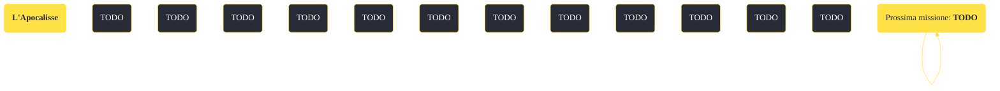

---
# Title, summary, and page position.
linktitle: "L'Apocalisse" 
summary: ""
weight: 10
icon: message-question
icon_pack: fas

# Page metadata.
title: "L'Apocalisse"
date: 2022-11-15
type: book # Do not modify.
commentable: true
tags: "Missioni di Lonesome Road"
hidden: true # Visibile nella sidebar
private: false # Nascosto dalle ricerche
---

*L'Apocalisse* è una missione del DLC *Lonesome Road* di Fallout: New Vegas. È data dal Pip-Boy.

<section class="chart-collapse">
<input type="checkbox" name="collapse2" id="handle2">
<h3 class="handle">
<label for="handle2">Clicca per mostrare il diagramma</label>
</h3>

</section>

| Tappe |       Stato        | Descrizione |
|:-----:|:------------------:| ----------- |
|                           10                          | :white_check_mark: | Corri verso i Rottami del canyon.                                                                                                                                           |
|                           20                          |            | Facoltativo: consegna l'ultimo messaggio di Ulysses.                                                                                                                        |

**Note**:
- Dalla fazione (o fazioni) colpita dalla testata i riceverai la reputazione più bassa ottenibile (Diffamato, Gorilla clemente, Diavolo dal cuore tenero o Bambino selvaggio), ma questo non significa che necessariamente quella fazione diventi ostile; questo può portare alla bizzarra situazione in cui le squadre di assassini, rispettivamente della Legione e dell'RNC, ti inseguiranno per poi rifiutarsi di attaccarti
- Se completi questa missione prima del confronto con Benny, è possibile togliere l'infamia della Legione con il Marchio di Caesar; similmente è possibile annullare l'infamia per l'RNC se si completa la missione prima di *Cose che scoppiano*, parlando con l'Ambasciatore Dennis Crocker
- Sia *L'Apocalisse* che *La fine* portano alle medesime ricompense, ma solo scegliendo di utilizzare le testate si sbloccheranno aree della mappa altrimenti irraggiungibili (la Long 15 e Dry Wells) e saranno ottenibili numerosi oggetti unici
- Tutti gli oggetti nell'inventario di ED-E torneranno nel tuo a fine missione

