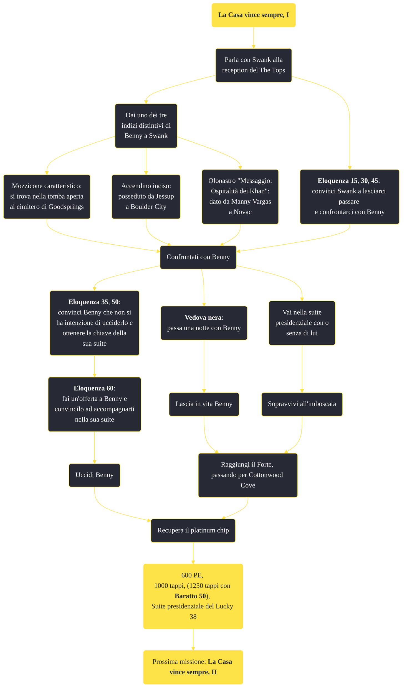

---
# Title, summary, and page position.
linktitle: "La Casa vince sempre, I"
summary: ""
weight: 10
icon: message-question
icon_pack: fas

# Page metadata.
title: "La Casa vince sempre, I"
date: 2022-11-15
type: book # Do not modify.
commentable: true
tags: "Missioni principali di Fallout: New Vegas"
hidden: true # Visibile nella sidebar
private: false # Nascosto dalle ricerche
---

*La Casa vince sempre, I* è una missione principale di Fallout: New Vegas. È data dal Sig. House al Lucky 38.

**Riassunto**:
1. Parla con Swank alla reception del The Tops
   - **Eloquenza 15**, **30**, **45**: convinci Swank a lasciarci passare e confrontarci con Benny
   - Dai uno dei tre indizi distintivi di Benny a Swank
      - Mozzicone caratteristico: si trova nella tomba aperta al cimitero di Goodsprings
      - Accendino inciso: posseduto da Jessup a Boulder City
      - Olonastro "Messaggio: Ospitalità dei Khan": dato da Manny Vargas a Novac
2. Confrontati con Benny
   - **Eloquenza 35**, **50**: convinci Benny che non si ha intenzione di ucciderlo e ottenere la chiave della sua suite
   -  **Eloquenza 60**: fai un'offerta a Benny e convincilo ad accompagnarti nella sua suite
   - **Vedova nera**: passa una notte con Benny
   - Vai nella suite presidenziale con o senza di lui
3.  Lascia in vita o uccidi Benny
4.  Sopravvivi all'imboscata
5.  Raggiungi il Forte, passando per Cottonwood Cove
6.  Recupera il platinum chip e consegnalo al Sig. House
7.  Ricompensa: **600 PE**, **1000 tappi**, (**1250 tappi** con **Baratto 50**), Suite presidenziale nel Lucky 38
8.  Prossima missione: *La Casa vince sempre, II*

<section class="chart-collapse">
<input type="checkbox" name="collapse2" id="handle2">
<h3 class="handle">
<label for="handle2">Clicca per mostrare il diagramma</label>
</h3>

</section>

| Tappe |       Stato        | Descrizione |
|:-----:|:------------------:| ----------- |
|                           5                           |            | Parla con il Sig. House al Lucky 38.                                                                                                                                        |
|                           7                           |            | (Opzionale) Parla di nuovo col Sig. House se vuoi lavorare per lui.                                                                                                         |
|                           10                          |            | Porta il Platinum Chip al Sig. House.                                                                                                                                       |
|                           12                          |            | Recupera il Platinum Chip al Forte.                                                                                                                                         |
|                           20                          |            | Consegna il Platinum Chip al Sig. House.                                                                                                                                    |
|                           25                          |            | Vai nello scantinato del Lucky 38.                                                                                                                                          |
|                           26                          |            | Osserva come il Sig. House potenzia i Securitron.                                                                                                                           |
|                           27                          | :white_check_mark: | Torna dal Sig. House.                                                                                                                                                       |

**Sfide abilità**:
- **Eloquenza 15**, **30**, **45**: parlando con Swank al The Tops
- **Eloquenza 35**, **50**, **60**: parlando con Benny
- **Vedova Nera**: parlando con Benny
- **Scasso 50**: per aprire la cassaforte a sinistra dell'entrata alla suite di Benny"

**Note**:
- I tre oggetti distintivi di Benny sono: 
  - il mozzicone di sigaretta caratteristico, nel cimitero di Goodsprings
  - l'accendino inciso, dato dai Great Khan a Boulder City
  - l'olonastro ""Messaggio: Ospitalità dei Khan"", nel terminale di Manny Vargas a Novac
- Se si va al Forte dopo aver recuperato il chip, esso verrà confiscato da Caesar e il Sig. House si rifiuterà di parlare con il Corriere, se non ha prima completato le missioni per la Legione

