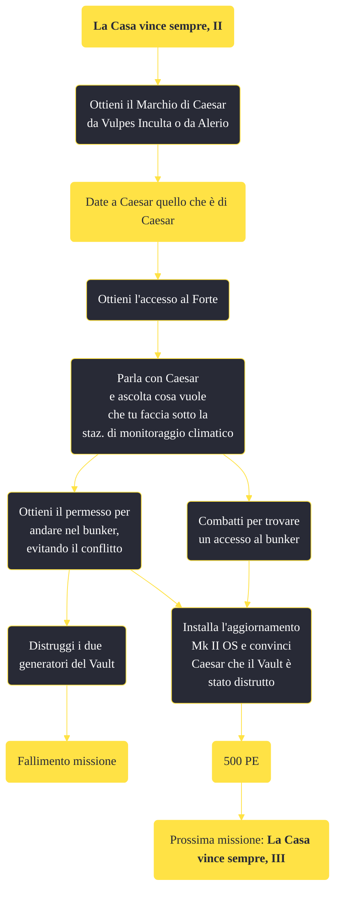

---
# Title, summary, and page position.
linktitle: "La Casa vince sempre, II"
summary: ""
weight: 10
icon: message-question
icon_pack: fas

# Page metadata.
title: "La Casa vince sempre, II"
date: 2022-11-15
type: book # Do not modify.
commentable: true
tags: "Missioni principali di Fallout: New Vegas"
hidden: true # Visibile nella sidebar
private: false # Nascosto dalle ricerche
---

*La Casa vince sempre, II* è una missione principale di Fallout: New Vegas. È data dal Sig. House al Lucky 38.

<section class="chart-collapse">
<input type="checkbox" name="collapse2" id="handle2">
<h3 class="handle">
<label for="handle2">Clicca per mostrare il diagramma</label>
</h3>

</section>

| Tappe |       Stato        | Descrizione |
|:-----:|:------------------:| ----------- |
|                           30                          |            | Usa il Platinum Chip per aprire il bunker segreto a Fortification Hill.                                                                                                     |
|                           31                          |            | Entra nel bunker segreto.                                                                                                                                                   |
|                           32                          |            | Potenzia l'esercito segreto di Securitron del Sig. House.                                                                                                                   |
|                           33                          |            | (Opzionale) Cambia idea e aggiorna l'armata segreta di Securitron del sig. House.                                                                                           |
|                           36                          | :white_check_mark: | Torna dal Sig. House per ricevere ulteriori istruzioni.                                                                                                                     |

**Sfide abilità**:
- **Scienza 50**, **75**: per disattivare le torrette

**Note**:
- È possibile iniziare questa missione senza parlare prima con il Sig. House e completare comunque il suo obiettivo, se il Corriere riesce a raggiungere il Forte e poi il bunker segreto 

