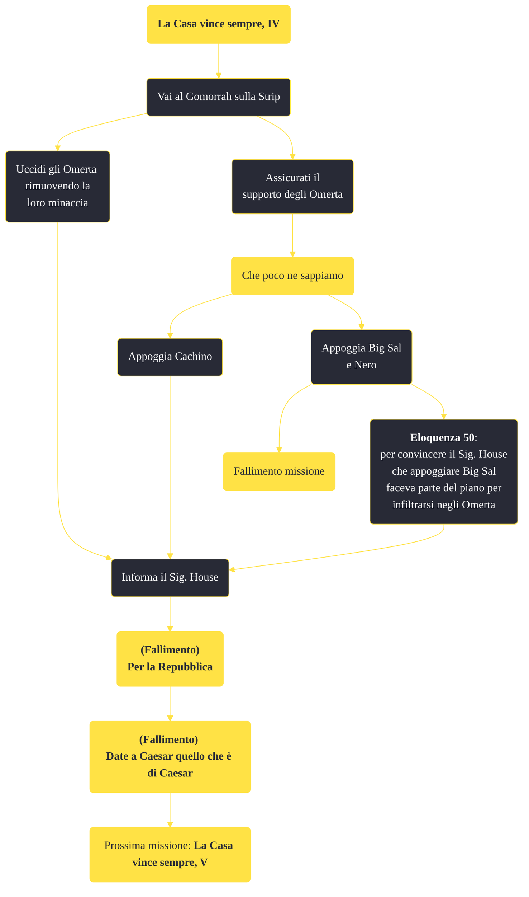

---
# Title, summary, and page position.
linktitle: "La Casa vince sempre, IV"
summary: ""
weight: 10
icon: message-question
icon_pack: fas

# Page metadata.
title: "La Casa vince sempre, IV"
date: 2022-11-15
type: book # Do not modify.
commentable: true
tags: "Missioni principali di Fallout: New Vegas"
hidden: true # Visibile nella sidebar
private: false # Nascosto dalle ricerche
---

*La Casa vince sempre, IV* è una missione principale di Fallout: New Vegas. È data dal Sig. House al Lucky 38.

<section class="chart-collapse">
<input type="checkbox" name="collapse2" id="handle2">
<h3 class="handle">
<label for="handle2">Clicca per mostrare il diagramma</label>
</h3>

</section>

| Tappe |       Stato        | Descrizione |
|:-----:|:------------------:| ----------- |
|                           50                          |            | Indaga sugli Omerta e fermali se i loro piani vanno a scapito degli interessi del Sig. House.                                                                               |
|                           51                          |            | (Opzionale) Informa il Sig. House del tradimento degli Omerta.                                                                                                              |
|                           52                          |            | Informa il Sig. House che gli Omerta sono stati neutralizzati.                                                                                                              |
|                           53                          | :white_check_mark: | Informa il sig. House che gli Omerta ti sono ostili.                                                                                                                        |

**Sfide abilità**:
- **Eloquenza 50**: convincere House (nel caso avessimo appoggiato Big Sal e Nero in Che poco ne sappiamo 

**Note**:
- Completando questa missione, si fallirà *Date a Caesar quello che è di Caesar* e *Per la Repubblica* 
- Questa missione è un punto di non ritorno, poiché completandola non sarà più possibile lavorare né per l'RNC né per la Legione di Caesar, poiché entrambe le fazioni diventeranno ostili 

