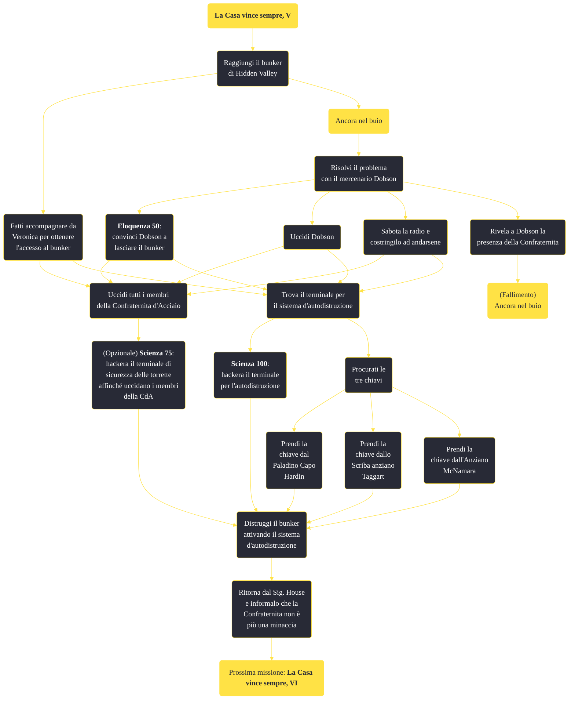

---
# Title, summary, and page position.
linktitle: "La Casa vince sempre, V"
summary: ""
weight: 10
icon: message-question
icon_pack: fas

# Page metadata.
title: "La Casa vince sempre, V"
date: 2022-11-15
type: book # Do not modify.
commentable: true
tags: "Missioni principali di Fallout: New Vegas"
hidden: true # Visibile nella sidebar
private: false # Nascosto dalle ricerche
---

*La Casa vince sempre, V* è una missione principale di Fallout: New Vegas. È data dal Sig. House al Lucky 38.

<section class="chart-collapse">
<input type="checkbox" name="collapse2" id="handle2">
<h3 class="handle">
<label for="handle2">Clicca per mostrare il diagramma</label>
</h3>

</section>

| Tappe |       Stato        | Descrizione |
|:-----:|:------------------:| ----------- |
|                           60                          |            | Trova la Confraternita d'Acciaio e distruggila.                                                                                                                             |
|                           62                          |            | (Opzionale) Informa il Sig. House che hai negoziato una soluzione pacifica con la Confraternita.                                                                            |
|                           64                          | :white_check_mark: | Informa il Sig. House che il bunker della Confraternita è stato distrutto.                                                                                                  |

**Sfide abilità**:
- **Scienza 100**: per attivare l'autodistruzione del bunker, senza la password

**Note**:
- Per creare la password d'autodistruzione è necessario borseggiare i codici in possesso dell'Anziano McNamara, del Paladino Capo Hardin e dello Scriba anziano Taggart (nel caso Hardin fosse diventato l'Anziano, bisognerà borseggiare il Paladino Ramos)

