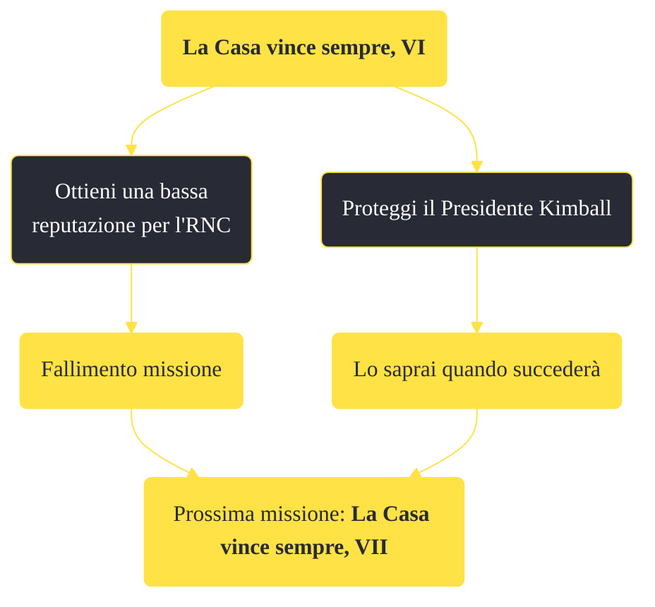

---
# Title, summary, and page position.
linktitle: "La Casa vince sempre, VI"
summary: ""
weight: 10
icon: message-question
icon_pack: fas

# Page metadata.
title: "La Casa vince sempre, VI"
date: 2022-11-15
type: book # Do not modify.
commentable: true
tags: "Missioni principali di Fallout: New Vegas"
hidden: true # Visibile nella sidebar
private: false # Nascosto dalle ricerche
---

*La Casa vince sempre, VI* è una missione principale di Fallout: New Vegas. È data dal Sig. House al Lucky 38.

**Riassunto**:
1. Parla con il Sig. House
   - Ottieni una bassa reputazione per l'RNC: *(fallimento) missione*
   - Proteggi il Presidente Kimball: *Lo saprai quando succederà*
2. Prossima missione: *La Casa vince sempre, VII*

<section class="chart-collapse">
<input type="checkbox" name="collapse2" id="handle2">
<h3 class="handle">
<label for="handle2">Clicca per mostrare il diagramma</label>
</h3>

</section>

| Tappe |       Stato        | Descrizione |
|:-----:|:------------------:| ----------- |
|                           70                          |            | Vai a Hoover Dam e proteggi il Presidente Kimball durante la sua visita.                                                                                                    |
|                           71                          |            | Informa il sig. House che la visita del Presidente Kimball è stata cancellata.                                                                                              |
|                           72                          |            | Informa il Sig. House che il Presidente Kimball è sopravvissuto all'attentato.                                                                                              |
|                           74                          | :white_check_mark: | Informa il Sig. House che il Presidente Kimball è morto.                                                                                                                    |

