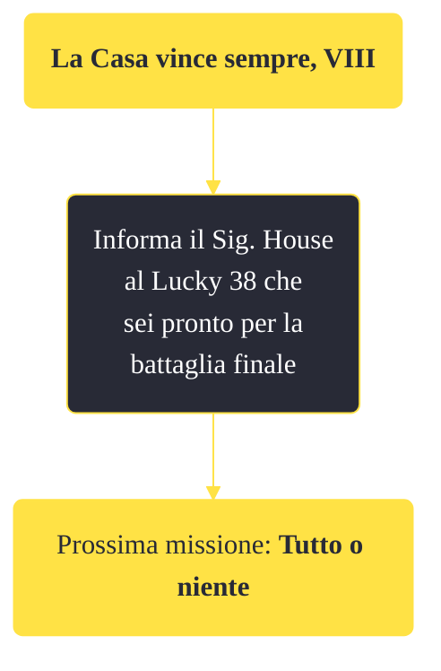

---
# Title, summary, and page position.
linktitle: "La Casa vince sempre, VIII"
summary: ""
weight: 10
icon: message-question
icon_pack: fas

# Page metadata.
title: "La Casa vince sempre, VIII"
date: 2022-11-15
type: book # Do not modify.
commentable: true
tags: "Missioni principali di Fallout: New Vegas"
hidden: true # Visibile nella sidebar
private: false # Nascosto dalle ricerche
---

*La Casa vince sempre, VIII* è una missione principale di Fallout: New Vegas. È data dal Sig. House a Hoover Dam.

<section class="chart-collapse">
<input type="checkbox" name="collapse2" id="handle2">
<h3 class="handle">
<label for="handle2">Clicca per mostrare il diagramma</label>
</h3>

</section>

| Tappe |       Stato        | Descrizione |
|:-----:|:------------------:| ----------- |
|                           1                           | :white_check_mark: | Vai a Hoover Dam e installa il chip comandi manuali nel computer della sala di controllo.                                                                                   |

