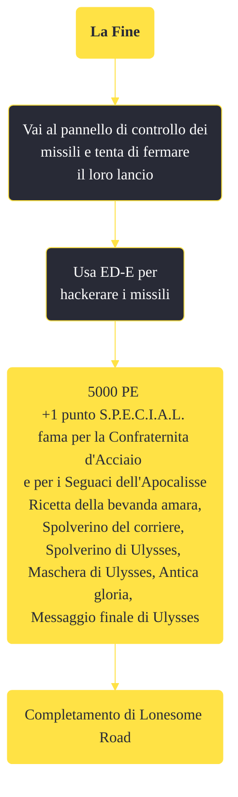

---
# Title, summary, and page position.
linktitle: "La Fine" 
summary: ""
weight: 10
icon: message-question
icon_pack: fas

# Page metadata.
title: "La Fine"
date: 2022-11-15
type: book # Do not modify.
commentable: true
tags: "Missioni di Lonesome Road"
hidden: true # Visibile nella sidebar
private: false # Nascosto dalle ricerche
---

*La Fine* è una missione del DLC *Lonesome Road* di Fallout: New Vegas. È data dal Pip-Boy.

<section class="chart-collapse">
<input type="checkbox" name="collapse2" id="handle2">
<h3 class="handle">
<label for="handle2">Clicca per mostrare il diagramma</label>
</h3>

</section>

| Tappe |       Stato        | Descrizione |
|:-----:|:------------------:| ----------- |
|                           10                          | :white_check_mark: | Annulla il lancio del missile.                                                                                                                                              |
|                           30                          | :white_check_mark: | Corri verso i Rottami del canyon.                                                                                                                                           |
|                           40                          | :white_check_mark: | Facoltativo: consegna l'ultimo messaggio di Ulysses.                                                                                                                        |

**Note**:
- Bloccare la sequenza di lancio e completare con successo questa missione è l'unico modo per ottenere abbastanza fama per la Confraternita d'Acciaio da poter essere idolatrato
- Sia *L'Apocalisse* che *La fine* portano alle medesime ricompense, ma solo scegliendo di utilizzare le testate si sbloccheranno aree della mappa altrimenti irraggiungibili (la Long 15 e Dry Wells) e saranno ottenibili numerosi oggetti unici
- Tutto ciò che è nell'inventario di ED-E, tornerà in nel tuo a fine missione

