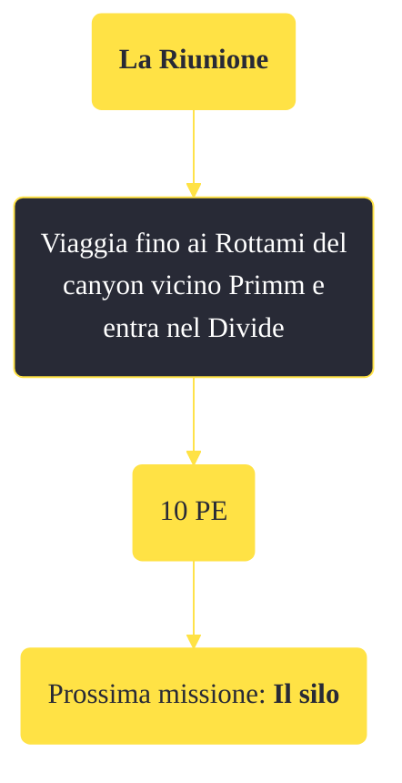

---
# Title, summary, and page position.
linktitle: "La Riunione" 
summary: ""
weight: 10
icon: message-question
icon_pack: fas

# Page metadata.
title: "La Riunione"
date: 2022-11-15
type: book # Do not modify.
commentable: true
tags: "Missioni di Lonesome Road"
hidden: true # Visibile nella sidebar
private: false # Nascosto dalle ricerche
---

*La Riunione* è una missione del DLC *Lonesome Road* di Fallout: New Vegas. È data dal Pip-Boy.

<section class="chart-collapse">
<input type="checkbox" name="collapse2" id="handle2">
<h3 class="handle">
<label for="handle2">Clicca per mostrare il diagramma</label>
</h3>

</section>

| Tappe |       Stato        | Descrizione                                                 |
| :---: | :----------------: | ----------------------------------------------------------- |
|  10   | :white_check_mark: | Vai ai Rottami del canyon vicino Primm ed entra nel Divide. |

