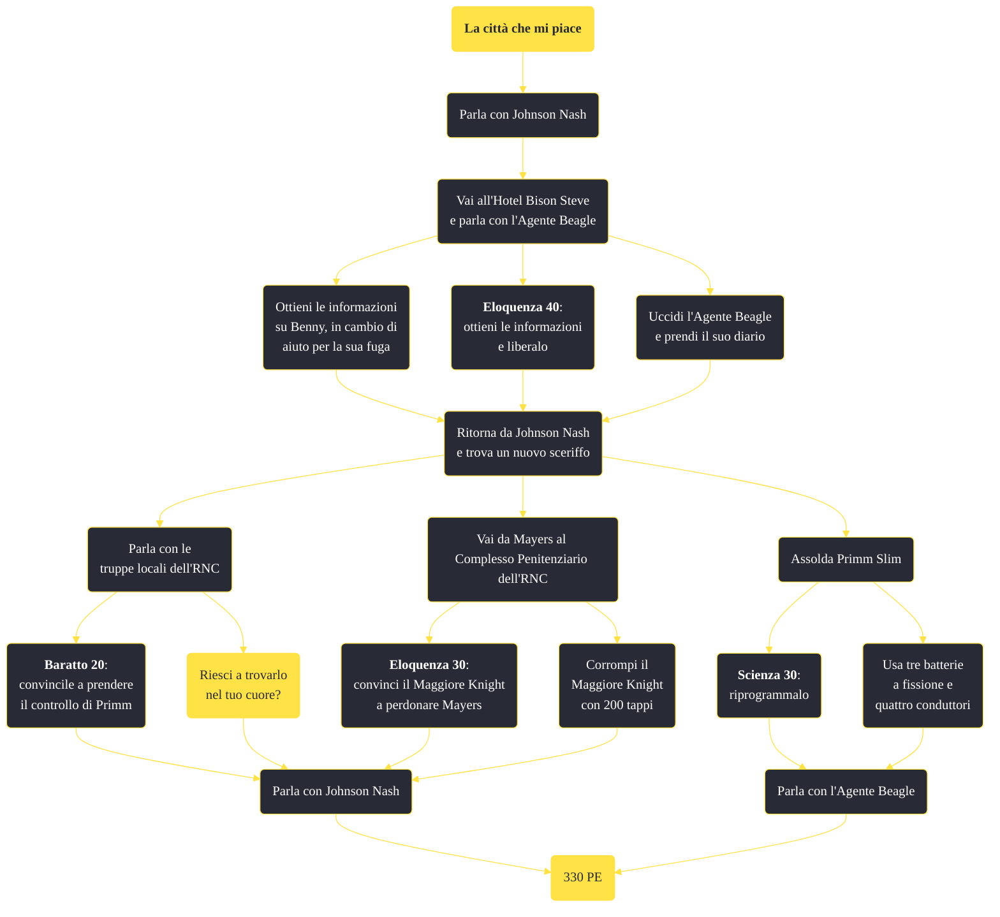

---
# Title, summary, and page position.
linktitle: "La città che mi piace"
summary: ""
weight: 10
icon: message-question
icon_pack: fas

# Page metadata.
title: "La città che mi piace"
date: 2022-11-15
type: book # Do not modify.
commentable: true
tags: "Missioni secondarie di Fallout: New Vegas"
hidden: true # Visibile nella sidebar
private: false # Nascosto dalle ricerche
---

*La città che mi piace* è una missione secondaria di Fallout: New Vegas. È data dall'Agente Beagle o da Johnson Nash a Primm.

<section class="chart-collapse">
<input type="checkbox" name="collapse2" id="handle2">
<h3 class="handle">
<label for="handle2">Clicca per mostrare il diagramma</label>
</h3>

</section>

| Tappe |       Stato        | Descrizione |
|:-----:|:------------------:| ----------- |
|                           10                          |            | L'agente Primm è stato catturato dai Powder Ganger al Bison Steve e deve essere salvato.                                                                                    |
|                           15                          |            | Beagle è stato salvato dal Bison Steve. Parlagli di come proteggere la città.                                                                                               |
|                           20                          |            | Beagle vuole un nuovo sceriffo per Primm. Ha proposto un ex sceriffo dell'NCRCF e l'RNC come possibili candidati.                                                           |
|                           21                          |            | Beagle è morto. Trova qualcuno a cui parlare per chiedere aiuto per Primm.                                                                                                  |
|                           22                          |            | Ora che Beagle è morto, Johnson Nash ha chiesto di aiutarlo a trovare un nuovo sceriffo. Ha proposto l'RNC o un ex sceriffo dell'NCRCF.                                     |
|                           25                          | :white_check_mark: | (Opzionale) Riprogramma Primm Slim perché diventi sceriffo di Primm.                                                                                                        |
|                           30                          | :white_check_mark: | Meyers, un ex sceriffo dell'NCRCF, è disposto ad assumere l'incarico di sceriffo di Primm se otterrà le scuse dell'RNC.                                                     |
|                           34                          |            | Hayes e l'RNC proteggeranno Primm se otterranno personale militare di rinforzo.                                                                                             |
|                           36                          |            | Torna da Meyers e comunicagli che l'RNC l'ha perdonato e che può assumere l'incarico di sceriffo.                                                                           |
|                           37                          | :white_check_mark: | Il Maggiore Knight ha promesso truppe aggiuntive per Primm. Parla con Hayes della protezione dell'RNC per Primm.                                                            |

**Sfide abilità**:
- **Eloquenza 30**: per ottenere il perdono del Maggiore Knight
- **Scienza 30**: per riprogrammare Primm Slim
- **Baratto 20**: per assoldare la squadra di supporto all'Avamposto del Mojave

**Note**:
- Scegliendo Meyers, Johnson Nash applicherà il 75% di sconto alla sua merce, se invece si sceglie l'RNC, i prezzi aumenteranno del 25%, ma aumenterà l'ammontare di munizioni da lui vendute 

