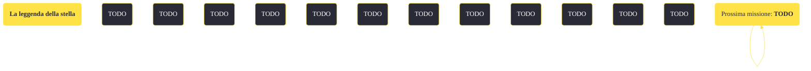

---
# Title, summary, and page position.
linktitle: "La leggenda della stella"
summary: ""
weight: 10
icon: message-question
icon_pack: fas

# Page metadata.
title: "La leggenda della stella"
date: 2022-11-15
type: book # Do not modify.
commentable: true
tags: "Missioni secondarie di Fallout: New Vegas"
hidden: true # Visibile nella sidebar
private: false # Nascosto dalle ricerche
---

*La leggenda della stella* è una missione secondaria di Fallout: New Vegas. È data da Festus alla sede Sunset Sarsaparilla.

<section class="chart-collapse">
<input type="checkbox" name="collapse2" id="handle2">
<h3 class="handle">
<label for="handle2">Clicca per mostrare il diagramma</label>
</h3>

</section>

| Tappe |       Stato        | Descrizione |
|:-----:|:------------------:| ----------- |
|                           10                          |            | Trova la sede della Sunset Sarsaparilla e parla con Festus.                                                                                                                 |
|                           20                          |            | Torna da Festus con abbastanza Tappi Stella Sunset Sarsaparilla per ricevere un premio!                                                                                     |
|                           30                          | :white_check_mark: | Dirigiti al punto di ritiro premi Sunset Sarsaparilla per ricevere il tuo vero premio.                                                                                      |

**Note**:
- Dopo il completamento di questa missione, tutti i tappi di bottiglia stella Sunset Sarsaparilla in eccesso ai 50 richiesti verranno convertiti in tappi normali
- Disattivando Festus con Esperto di robotica la missione sarà impossibile da completare 

