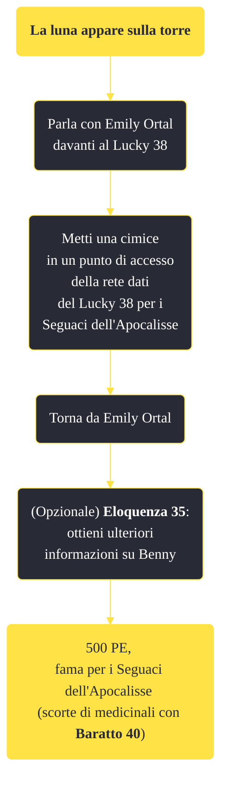

---
# Title, summary, and page position.
linktitle: "La luna appare sulla torre"
summary: ""
weight: 10
icon: message-question
icon_pack: fas

# Page metadata.
title: "La luna appare sulla torre"
date: 2022-11-15
type: book # Do not modify.
commentable: true
tags: "Missioni secondarie di Fallout: New Vegas"
hidden: true # Visibile nella sidebar
private: false # Nascosto dalle ricerche
---

*La luna appare sulla torre* è una missione secondaria di Fallout: New Vegas. È data da Emily Ortal davanti al Lucky 38, sulla Strip.

<section class="chart-collapse">
<input type="checkbox" name="collapse2" id="handle2">
<h3 class="handle">
<label for="handle2">Clicca per mostrare il diagramma</label>
</h3>

</section>

| Tappe |       Stato        | Descrizione |
|:-----:|:------------------:| ----------- |
|                           10                          |            | Metti una cimice in un punto di accesso della rete dati del Lucky 38 per i Seguaci dell'Apocalisse.                                                                         |
|                           15                          |            | Disattiva la codificazione della rete del Lucky 38 da tre console di comando.                                                                                               |
|                           20                          | :white_check_mark: | Torna da Emily Ortal sulla Strip di New Vegas riferendole che è stata piazzata una cimice sulla torre.                                                                      |

**Sfide abilità**:
- **Eloquenza 35**: per ottenere alcune informazioni su Benny da Emily
- **Baratto 40**: per ottenere da Emily alcune scorte medicinali

**Note**:
- Emily non apparirà finché non avrai sistemato Benny e preso possesso del Platinum Chip
- È possibile dire a House di essere in possesso di una cimice, ma lui, non appena questa verrà installata, sarà in grado sia di rilevarla che di disattivarla 

