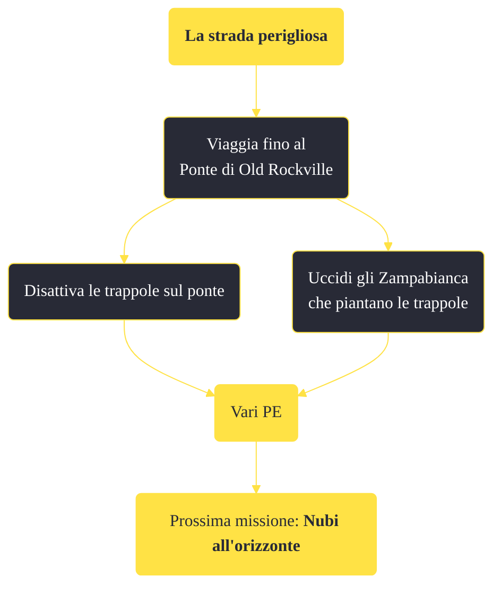

---
# Title, summary, and page position.
linktitle: "La strada perigliosa"
summary: ""
weight: 10
icon: message-question
icon_pack: fas

# Page metadata.
title: "La strada perigliosa"
date: 2022-11-15
type: book # Do not modify.
commentable: true
tags: "Missioni di Honest Hearts"
hidden: true # Visibile nella sidebar
private: false # Nascosto dalle ricerche
---

*La strada perigliosa* è una missione del DLC *Honest Hearts* di Fallout: New Vegas. È data da Daniel al ponte di Old Rockville.

**Riassunto**:
1. Viaggia fino al Ponte di Old Rockville
   - Disattiva le trappole sul ponte
   - Uccidi gli Zampabianca che piantano le trappole
2. Ricompensa: **vari PE**
3. Prossima missione: *Nubi all'orizzonte*

<section class="chart-collapse">
<input type="checkbox" name="collapse2" id="handle2">
<h3 class="handle">
<label for="handle2">Clicca per mostrare il diagramma</label>
</h3>

</section>

| Tappe |       Stato        | Descrizione |
|:-----:|:------------------:| ----------- |
|                           10                          | :white_check_mark: | Occupati delle trappole degli Zampabianca.                                                                                                                                  |
|                           25                          | :white_check_mark: | Opzionale: Disinnesca le trappole sul ponte.                                                                                                                                |
|                           28                          | :white_check_mark: | Opzionale: Uccidi gli Zampabianca che stanno piazzando le trappole.                                                                                                         |

**Note**:
- È possibile che alcuni gechi o Yao Guai compaiano nei pressi del ponte, uccidendo gli Zampabianca e completando automaticamente la missione

