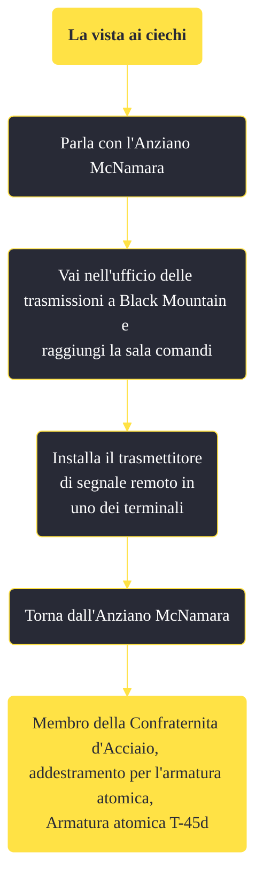

---
# Title, summary, and page position.
linktitle: "La vista ai ciechi"
summary: ""
weight: 10
icon: message-question
icon_pack: fas

# Page metadata.
title: "La vista ai ciechi"
date: 2022-11-15
type: book # Do not modify.
commentable: true
tags: "Missioni secondarie di Fallout: New Vegas"
hidden: true # Visibile nella sidebar
private: false # Nascosto dalle ricerche
---

*La vista ai ciechi* è una missione secondaria di Fallout: New Vegas. È data dall'Anziano McNamara nel bunker di Hidden Valley.

**Riassunto**:
1. Parla con l'Anziano McNamara
2. Vai nell'ufficio delle trasmissioni a Black Mountain e raggiungi la sala comandi
3. Installa il trasmettitore di segnale remoto in uno dei terminali
4. Torna dall'Anziano McNamara
5. Ricompensa: **addestramento per l'armatura atomica**, **Armatura atomica T-45d**

<section class="chart-collapse">
<input type="checkbox" name="collapse2" id="handle2">
<h3 class="handle">
<label for="handle2">Clicca per mostrare il diagramma</label>
</h3>

</section>

| Tappe |       Stato        | Descrizione |
|:-----:|:------------------:| ----------- |
|                           10                          |            | Dirigiti a Black Mountain e installa il trasmettitore di segnale remoto in una delle console.                                                                               |
|                           20                          | :white_check_mark: | Riferisci a McNamara che il dispositivo è stato installato.                                                                                                                 |

**Note**:
- Questa missione è disponibile solo dopo aver completato *Ancora al buio*
- Se hai sostituito McNamara con Hardin, questa missione sarà inaccessibile e verrà sostituita da *Fatti gli affari tuoi*
- Se hai già completato la missione *Valzer delle candele*, è possibile dire a McNamara di aver già avuto l'addestramento per l'armatura atomica 

