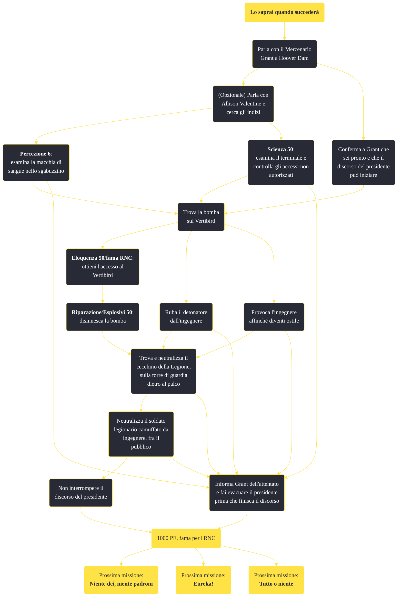

---
# Title, summary, and page position.
linktitle: Lo saprai quando succederà
summary: ""
weight: 10
icon: message-question
icon_pack: fas

# Page metadata.
title: Lo saprai quando succederà
date: 2022-11-15
type: book # Do not modify.
commentable: true
tags: "Missioni principali di Fallout: New Vegas"
hidden: true # Visibile nella sidebar
private: false # Nascosto dalle ricerche
---

*Lo saprai quando succederà* è una missione principale di Fallout: New Vegas. È data da Yes Man, il Sig. House o il Mercenario Grant a Hoover Dam.

<section class="chart-collapse">
<input type="checkbox" name="collapse2" id="handle2">
<h3 class="handle">
<label for="handle2">Clicca per mostrare il diagramma</label>
</h3>

</section>

| Tappe |       Stato        | Descrizione |
|:-----:|:------------------:| ----------- |
|                           10                          |            | Fai rapporto al Mercenario Grant.                                                                                                                                           |
|                           15                          |            | Incontra il Mercenario Grant sul ponte di osservazione                                                                                                                      |
|                           16                          |            | [Opzionale] Perquisisci l'area alla ricerca di indizi                                                                                                                       |
|                           17                          |            | Tieni d'occhio le posizioni dei cecchini                                                                                                                                    |
|                           20                          |            | Proteggi il Presidente Kimball                                                                                                                                              |
|                           60                          |            | Riferisci le tue scoperte al Mercenario Grant                                                                                                                               |
|                          100                          | :white_check_mark: | Kimball è sano e salvo, riferiscilo al Mercenario Grant                                                                                                                     |
|                          110                          |   ❌  | Kimball è stato ucciso, riferiscilo al Mercenario Grant                                                                                                                     |

**Sfide abilità**:
- **Percezione 6**: per analizzare la macchia di sangue
- **Scienza 50**: per hackerare il terminale all'Ufficio turistico e scoprire l'accesso non autorizzato
- **Eloquenza 50**: per persuadere il Soldato semplice Jensen
- **Esplosivi/Riparazione 50**: per disinnescare la bomba

**Note**:
- Rex è in grado di smascherare il finto ingegnere, mentre Boone risulterà utile nel trovare il cecchino
- È necessario avere una reputazione positiva ("Accettato") con l'RNC per poter effettuare questa missione

