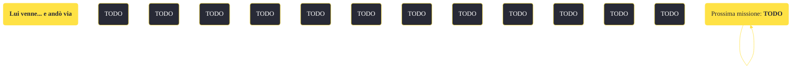

---
# Title, summary, and page position.
linktitle: "Lui venne... e andò via" 
summary: ""
weight: 10
icon: message-question
icon_pack: fas

# Page metadata.
title: "Lui venne... e andò via"
date: 2022-11-15
type: book # Do not modify.
commentable: true
tags: "Missioni di Old World Blues"
hidden: true # Visibile nella sidebar
private: false # Nascosto dalle ricerche
---

*Lui venne... e andò via* è una missione del DLC *Old World Blues* di Fallout: New Vegas. È data dalla dottoressa Dala al Serbatoio del pensiero.

<section class="chart-collapse">
<input type="checkbox" name="collapse2" id="handle2">
<h3 class="handle">
<label for="handle2">Clicca per mostrare il diagramma</label>
</h3>

</section>

| Tappe |       Stato        | Descrizione |
|:-----:|:------------------:| ----------- |
|                           10                          | :white_check_mark: | Parla con il Dr. Klein per ricevere informazioni sulla conversazione tra lui e l'ultimo visitatore del Grande Vuoto.                                                        |

