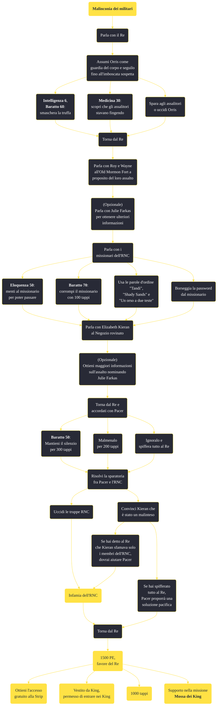

---
# Title, summary, and page position.
linktitle: "Malinconia dei militari"
summary: ""
weight: 10
icon: message-question
icon_pack: fas

# Page metadata.
title: "Malinconia dei militari"
date: 2022-11-15
type: book # Do not modify.
commentable: true
tags: "Missioni secondarie di Fallout: New Vegas"
hidden: true # Visibile nella sidebar
private: false # Nascosto dalle ricerche
---

*Malinconia dei militari* è una missione secondaria di Fallout: New Vegas. È data dal Re alla King's School of Impersonation.

**Riassunto**:
1. Parla con il Re
2. Assumi Orris come guardia del corpo e seguilo fino all'imboscata sospetta
   - **Intelligenza 6**, **Baratto 60**: smaschera la truffa
   - **Medicina 30**: scopri che gli assalitori stavano fingendo
   - Spara agli assalitori o uccidi Orris
3. Torna dal Re
4. Parla con Roy e Wayne all'Old Mormon Fort a proposito del loro assalto
5. (Opzionale) Parla con Julie Farkas per ottenere ulteriori informazioni
6. Parla con i missionari dell'RNC
   - **Eloquenza 50**: menti al missionario per poter passare
   - **Baratto 70**: corrompi il missionario con 100 tappi
   -  Usa le parole d'ordine  "Tandi",  "Shady Sands" e "Un orso a due teste""
   -  Borseggia la password dal missionario
7.  Parla con Elizabeth Kieran al Negozio rovinato
8.  (Opzionale) Ottieni maggiori informazioni sull'assalto nominando Julie Farkas
9.  Torna dal Re e accordati con Pacer
   -  **Baratto 50**: Mantieni il silenzio per 300 tappi
   -  Malmenalo per 200 tappi
   -  Ignoralo e spiffera tutto al Re
10. Risolvi la sparatoria fra Pacer e l'RNC
   -  Uccidi le truppe RNC: **infamia dell'RNC**
   -  Convinci Kieran che è stato un malinteso
        -  Se hai detto al Re che Kieran sfamava solo i membri dell'RNC, dovrai aiutare Pacer: **infamia dell'RNC**
        -  Se hai spifferato tutto al Re, Pacer proporrà una soluzione pacifica
11. Torna dal Re
12. Ricompensa: **1500 PE**, favore del Re

<section class="chart-collapse">
<input type="checkbox" name="collapse2" id="handle2">
<h3 class="handle">
<label for="handle2">Clicca per mostrare il diagramma</label>
</h3>

</section>

| Tappe |       Stato        | Descrizione |
|:-----:|:------------------:| ----------- |
|                           10                          |            | Assumi una guardia di nome Orris vicino al cancello settentrionale di Freeside.                                                                                             |
|                           20                          |            | Segui Orris fino al cancello meridionale e fai attenzione a qualsiasi comportamento sospetto.                                                                               |
|                           25                          |            | Torna dal Re e riferisci che non hai scoperto niente su Orris.                                                                                                              |
|                           26                          |            | Assumi di nuovo Orris e controlla eventuali atteggiamenti sospetti.                                                                                                         |
|                           30                          |            | Torna dal Re e riferiscigli cosa hai scoperto su Orris.                                                                                                                     |
|                           31                          |            | Torna dal Re e riferiscigli che Orris è morto.                                                                                                                              |
|                           32                          |            | Torna dal Re e riferiscigli che Orris se n'è andato.                                                                                                                        |
|                           60                          |            | Vai all'Old Mormon Fort e interroga alcuni abitanti del luogo feriti sui loro assalitori.                                                                                   |
|                           65                          |            | Torna dal Re con le tue scoperte.                                                                                                                                           |
|                           70                          |            | Dirigiti a uno dei campi squatter a Freeside e scopri perché i soldati dell'RNC sono entrati nell'area.                                                                     |
|                           71                          |            | (Opzionale) Parla con Julie Farkas e scopri se i Seguaci sanno qualcosa riguardo alla situazione.                                                                           |
|                           72                          |            | (Opzionale) Parla con il Maggiore Elizabeth Kieran e fai il nome di Julie Farkas se è restia a collaborare.                                                                |
|                           73                          |            | (Opzionale) Informa il Re che l'RNC aveva precedentemente mandato un inviato a discutere della distribuzione dei rifornimenti a Freeside                                    |
|                           75                          |            | Chiedi in giro al campo squatter per trovare un indizio sul motivo per cui i soldati dell'RNC sono a Freeside.                                                              |
|                           80                          |            | Indaga sulle voci di una distribuzione notturna gratuita di cibo e acqua nella parte nordoccidentale di Freeside.                                                           |
|                           90                          |            | Torna dal Re e informalo delle riduzioni dei rifornimenti dell'RNC.                                                                                                         |
|                           95                          |            | Dirigiti all'edificio riduzione rifornimenti e vedi se Pacer ha bisogno di aiuto.                                                                                           |
|                           96                          |            | Uccidi tutte le truppe dell'RNC nascoste nella stazione ferroviaria a nordovest di Freeside.                                                                                |
|                           98                          |            | Dirigiti alla stazione ferroviaria nella parte nordoccidentale di Freeside e cerca di negoziare con l'RNC.                                                                  |
|                          100                          | :white_check_mark: | Torna dal Re e comunicagli che le truppe dell'RNC a Freeside sono state sistemate.                                                                                          |
|                          101                          | :white_check_mark: | Torna dal Re e comunicagli che la situazione con l'RNC si è tranquillizzata.                                                                                                |

**Sfide abilità**:
- **Intelligenza 6** e **Baratto 60** oppure **Medicina 30**: per smascherare la truffa di Orris
- **Eloquenza 50**/**Baratto 70**: per mentire ai missionari RNC o corromperli (con 100 tappi)
- **Baratto 50**: per aumentare a 300 tappi il prezzo del proprio silenzio con Pacer

**Note**:
- Le risposte al test dei due missionari RNC sono "Tandi", "Shady Sands" e "Un orso a due teste"
- Il favore del Re può essere sfruttato per:
  - ottenere l'accesso alla Strip gratuitamente; Ralph stamperà un passaporto falso per il Corriere senza alcuna spesa aggiuntiva
  - il permesso di entrare nei King, ottenendo il Vestito da King e un taglio gratuito da Sergio
  - ottenere 1000 tappi
  - risolvere qualche altra questione spinosa con l'RNC, in *Mossa dei King* 

