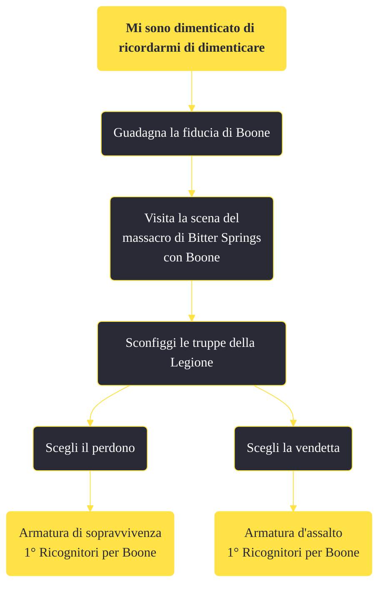

---
# Title, summary, and page position.
linktitle: "Mi sono dimenticato di ricordarmi di dimenticare"
summary: ""
weight: 10
icon: message-question
icon_pack: fas

# Page metadata.
title: "Mi sono dimenticato di ricordarmi di dimenticare"
date: 2022-11-15
type: book # Do not modify.
commentable: true
tags: "Missioni secondarie di Fallout: New Vegas"
hidden: true # Visibile nella sidebar
private: false # Nascosto dalle ricerche
---

*Mi sono dimenticato di ricordarmi di dimenticare* è una missione secondaria di Fallout: New Vegas. È data da Boone a Novac.

<section class="chart-collapse">
<input type="checkbox" name="collapse2" id="handle2">
<h3 class="handle">
<label for="handle2">Clicca per mostrare il diagramma</label>
</h3>

</section>

| Tappe |       Stato        | Descrizione |
|:-----:|:------------------:| ----------- |
|                           10                          |            | Viaggia fino a Bitter Springs con Boone                                                                                                                                     |
|                           20                          |            | Vai con Boone al Coyote Tail Ridge.                                                                                                                                         |
|                           30                          |            | Parla con Boone riguardo a un possibile pernottamento a Coyote Tail Ridge.                                                                                                  |
|                           40                          |            | Parla con Boone.                                                                                                                                                            |
|                           50                          |            | Vai al campo profughi di Bitter Springs e respingi l'assalto della Legione.                                                                                                 |
|                           60                          | :white_check_mark: | Parla con Boone.                                                                                                                                                            |

**Note**:
- La fiducia di Boone viene calcolata con un valore numerico, che si accumula eseguendo determinate azioni; raggiunto il valore di 5, si sbloccherà un dialogo e inizierà la missione. È possibile ottenere dei "punto fiducia" nei seguenti modi:
  - uccidere Vulpes Inculta (1) e Caesar (2)
  - uccidere il centurione imprigionato a Camp McCarran, Silus (1)
  - parlare al Sergente Bitter-Root, a Camp McCarran, della sua storia (1)
  - affrontare e uccidere la spia durante la missione Ti ho stregato (1) e disinnescare la bomba sulla monorotaia (1)
  - salvare i Powder Ganger in ostaggio all'Accampamento attacco Legione durante la missione Cacciato (2)
  - salvando i soldati crocifissi a Nelson (2) o uccidendoli per pietà (1) durante la missione Torna nel tuo cortile
  - durante la missione Occhio per occhio, massacrando i Legionari, incluso Aurelius of Phoenix, a Cottonwood Cove (2)
- Successivamente sarà necessario parlare con Manny Vargas a Novac o con il Sergente Bitter-Root a Camp McCarran a proposito del Massacro di Bitter Springs
- Per poter attivare questa missione è necessario, oltre che ottenere la fiducia di Boone, esaurire tutte le domande riguardo il suo passato e sua moglie. È possibile che Boone inizi il dialogo per attivare la missione, dopo aver guadagnato un "punto fiducia", ma non è sempre così 

