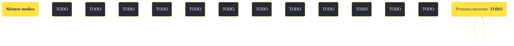

---
# Title, summary, and page position.
linktitle: "Mistero medico"
summary: ""
weight: 10
icon: message-question
icon_pack: fas

# Page metadata.
title: "Mistero medico"
date: 2022-11-15
type: book # Do not modify.
commentable: true
tags: "Missioni secondarie di Fallout: New Vegas"
hidden: true # Visibile nella sidebar
private: false # Nascosto dalle ricerche
---

*Mistero medico* è una missione secondaria di Fallout: New Vegas. È data dal Dott. Richards a Camp Forlorn Hope.

<section class="chart-collapse">
<input type="checkbox" name="collapse2" id="handle2">
<h3 class="handle">
<label for="handle2">Clicca per mostrare il diagramma</label>
</h3>

</section>

| Tappe |       Stato        | Descrizione |
|:-----:|:------------------:| ----------- |
|                           20                          |            | Perlustra Camp Forlorn Hope alla ricerca di indizi sulle scorte di medicinali scomparse.                                                                                    |
|                           25                          |            | Sorveglia il Centro Medico di Camp Forlorn Hope Medical di notte.                                                                                                           |
|                           60                          |            | Riferisci le tue scoperte al Dott. Richards.                                                                                                                                |
|                           90                          |            | Torna dal Dott. Richards.                                                                                                                                                   |
|                          100                          | :white_check_mark: | Ho informato il Dott. Richards che il Soldato semplice Stone rubava le scorte.                                                                                              |

**Sfide abilità**:
- **Medicina 50**: per ottenere altre informazioni sul furto di medicinali
- **Eloquenza 50**: per accusare il Soldato semplice Stone
- **Eloquenza 60**: per convincere Stone a costituirsi

