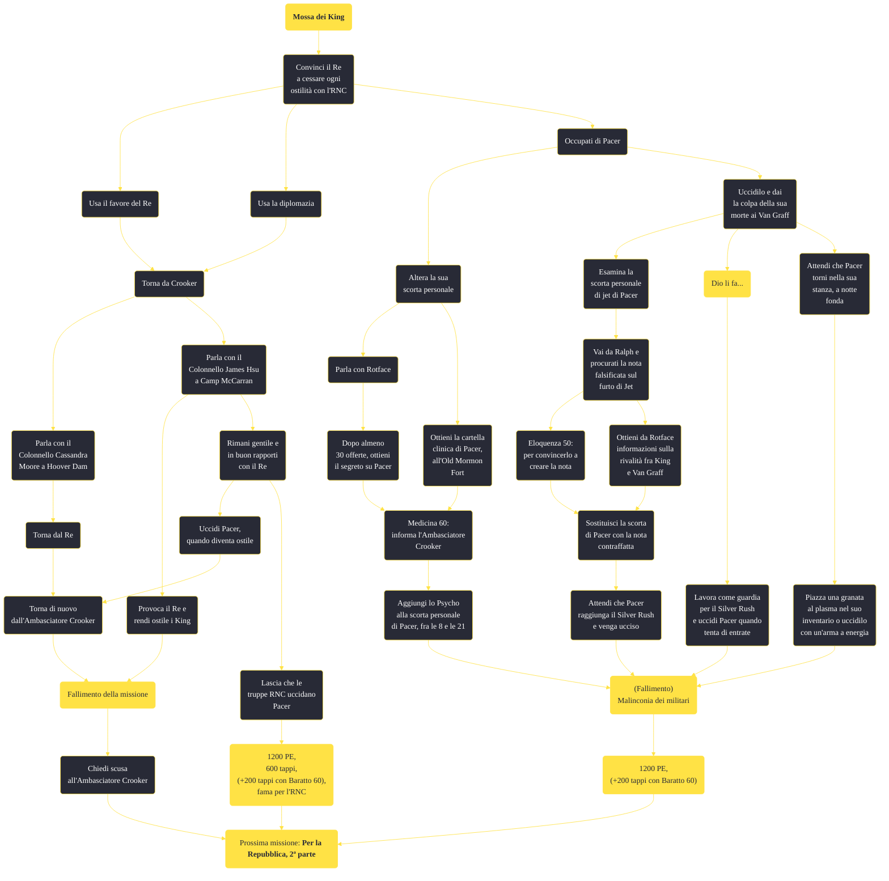

---
# Title, summary, and page position.
linktitle: "Mossa dei King"
summary: ""
weight: 10
icon: message-question
icon_pack: fas

# Page metadata.
title: "Mossa dei King"
date: 2022-11-15
type: book # Do not modify.
commentable: true
tags: "Missioni principali di Fallout: New Vegas"
hidden: true # Visibile nella sidebar
private: false # Nascosto dalle ricerche
---

*Mossa dei King* è una missione principale di Fallout: New Vegas. È data dall'Ambasciatore Dennis Crocker all'Ambasciata dell'RNC.

<section class="chart-collapse">
<input type="checkbox" name="collapse2" id="handle2">
<h3 class="handle">
<label for="handle2">Clicca per mostrare il diagramma</label>
</h3>

</section>

| Tappe |       Stato        | Descrizione |
|:-----:|:------------------:| ----------- |
|                           10                          |            | Uccidi Pacer facendolo sembrare un omicidio in cui sia coinvolto qualcuno estraneo all'RNC o convinci il Re a far cessare le ostilità con l'RNC.                            |
|                           11                          |            | (Opzionale) Uccidi Pacer in modo tale da coinvolgere la famiglia Van Graff                                                                                                  |
|                           12                          |            | (Opzionale) Uccidi Pacer aggiungendo della Psycho alla sua Jet                                                                                                              |
|                           13                          |            | (Opzionale) Porta a termine dei compiti per il Re per ingraziarti i suoi favori                                                                                             |
|                           20                          | :white_check_mark: | Torna dall'Ambasciatore Crocker con la notizia della morte di Pacer                                                                                                         |
|                           40                          | :white_check_mark: | Torna dall'Ambasciatore Crocker per riferirgli che il Re ha accettato di cessare le ostilità                                                                                |
|                           41                          |            | Torna dall'Ambasciatore Crocker per riferirgli che il Re non porrà freno alla violenza a Freeside                                                                           |
|                           50                          |            | Parla con il Colonnello Moore a Hoover Dam per ottenere ulteriori istruzioni riguardo alla situazione a Freeside                                                            |
|                           51                          |            | (Opzionale) Parla con il Colonnello Hsu a Camp McCarran per ottenere ulteriori istruzioni riguardo alla situazione a Freeside                                               |
|                           60                          |            | Vai alla Kings' School of Impersonation e consegna un ultimatum al Re, spalleggiato da una squadra di soldati dell'RNC                                                      |
|                           65                          |            | Aiuta i soldati dell'RNC a uccidere i King                                                                                                                                  |
|                           70                          |            | Vai alla Kings' School of Impersonation e offri al Re il sostegno ufficiale dell'RNC se decide di cessare le ostilità                                                       |
|                           75                          |            | Impedisci a Pacer di rovinare il trattato tra i King e l'RNC.                                                                                                               |
|                           80                          | :white_check_mark: | Torna dall'Ambasciatore Crocker e riferiscigli che il Re ha accettato l'ultimatum e che cesserà le ostilità.                                                                |
|                           81                          |   ❌  | Torna dall'Ambasciatore Crocker e comunicagli che i King sono stati eliminati                                                                                               |
|                           90                          | :white_check_mark: | Torna dall'Ambasciatore Crocker e riferiscigli che il Re ha accettato l'impegno del Colonnello Hsu a fornire il sostegno dell'RNC                                           |
|                           91                          |   ❌  | Torna dall'Ambasciatore Crocker e comunicagli che i King sono stati eliminati                                                                                               |

**Sfide abilità**:
- **Medicina 60**: parlando con l'Ambasciatore Dennis Crocker
- **Eloquenza 50**: per convincere Ralph a contraffare la nota
- **Baratto 60**: per ottenere altri 200 tappi di ricompensa da Crocker

**Note**:
- [Alterare la partita di droga] Uccidere Pacer in qualsiasi modo farà fallire la missione *Malinconia dei militari*, se non è stata già completata e si vuole ottenere il favore dal Re
- [Incolpare i Van Graff, attraverso la nota di Jean-Baptiste Cutting] Questo metodo funziona anche se sono già stati eliminati tutti i membri del Silver Rush: basta seguire Pacer e, arrivato nell'edificio, ucciderlo con un'arma a energia (o laser), così che la colpa ricada comunque ai Van Graff. È importante parlare con il Re prima di tornare da Crocker
- [Incolpare i Van Graff, piazzando una granata al plasma nell'inventario di Pacer] Devi prima tornare dall'Ambasciatore, dopo aver parlato con Rotface, altrimenti Pacer non tornerà mai nella sua stanza
- [Incolpare i Van Graff, iniziando *Dio li fa...* e uccidendo Pacer mentre si è di guarda al Silver Rush] i King non diventeranno ostili e rimane possibile finire con successo anche *Dio li fa...*, ma renderà problematico il completamento della missione *Malinconia dei militari*, che va quindi finita prima di completare questa missione
- [Informare l'RNC] Scegliendo di informare il Colonnello James Hsu, è consigliato lasciare che siano le truppe RNC ad uccidere Pacer, per evitare che i King diventino ostili

