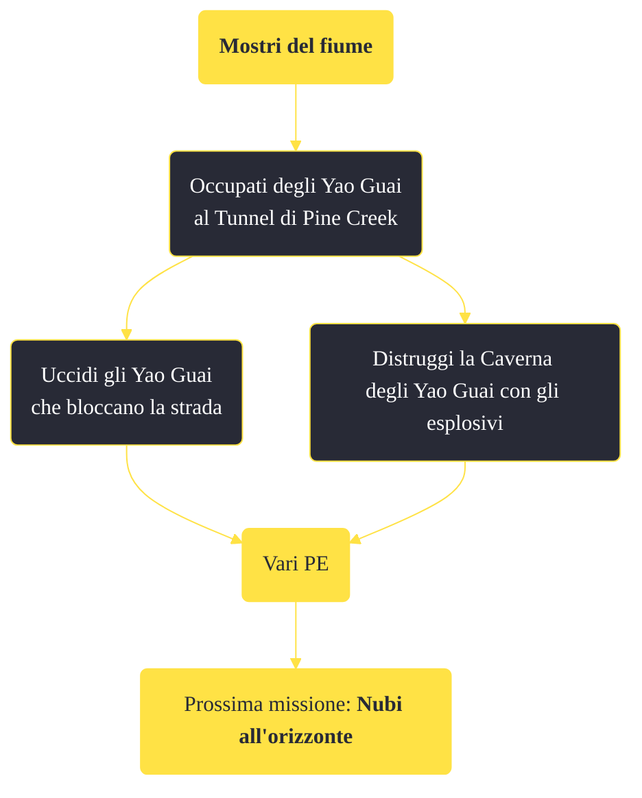

---
# Title, summary, and page position.
linktitle: "Mostri del fiume"
summary: ""
weight: 10
icon: message-question
icon_pack: fas

# Page metadata.
title: "Mostri del fiume"
date: 2022-11-15
type: book # Do not modify.
commentable: true
tags: "Missioni di Honest Hearts"
hidden: true # Visibile nella sidebar
private: false # Nascosto dalle ricerche
---

*Mostri del fiume* è una missione del DLC *Honest Hearts* di Fallout: New Vegas. È data da Daniel alla caverna degli Yao Guai.

<section class="chart-collapse">
<input type="checkbox" name="collapse2" id="handle2">
<h3 class="handle">
<label for="handle2">Clicca per mostrare il diagramma</label>
</h3>

</section>

| Tappe |       Stato        | Descrizione |
|:-----:|:------------------:| ----------- |
|                           10                          |            | Affronta gli Yao Guai a Pine Creek.                                                                                                                                         |
|                           35                          | :white_check_mark: | Opzionale: Fa' crollare la caverna degli Yao Guai.                                                                                                                          |
|                           36                          |            | Piazza dell'esplosivo in punti chiave della caverna.                                                                                                                        |
|                           37                          | :white_check_mark: | Abbandona la caverna e fa' saltare le cariche col detonatore da miniera.                                                                                                    |
|                           38                          | :white_check_mark: | Opzionale: Uccidi gli Yao Guai a Pine Creek.                                                                                                                                |

**Note**:
- Una volta piazzati gli esplosivi, la caverna non sarà più visitabile

